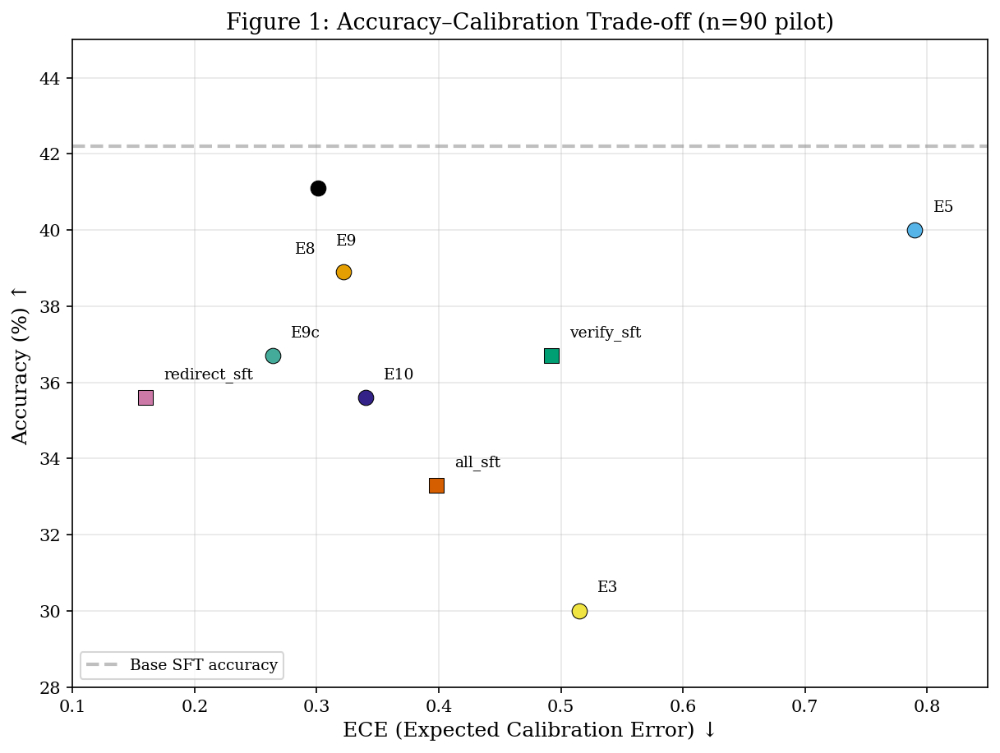
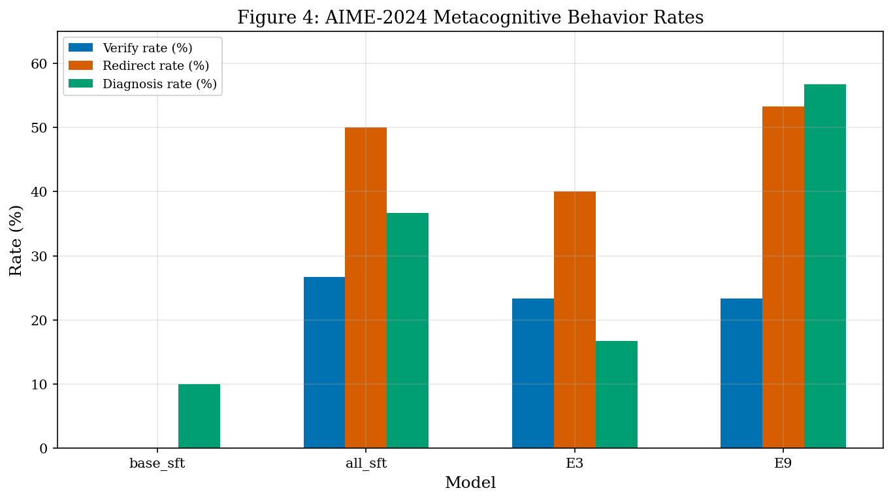
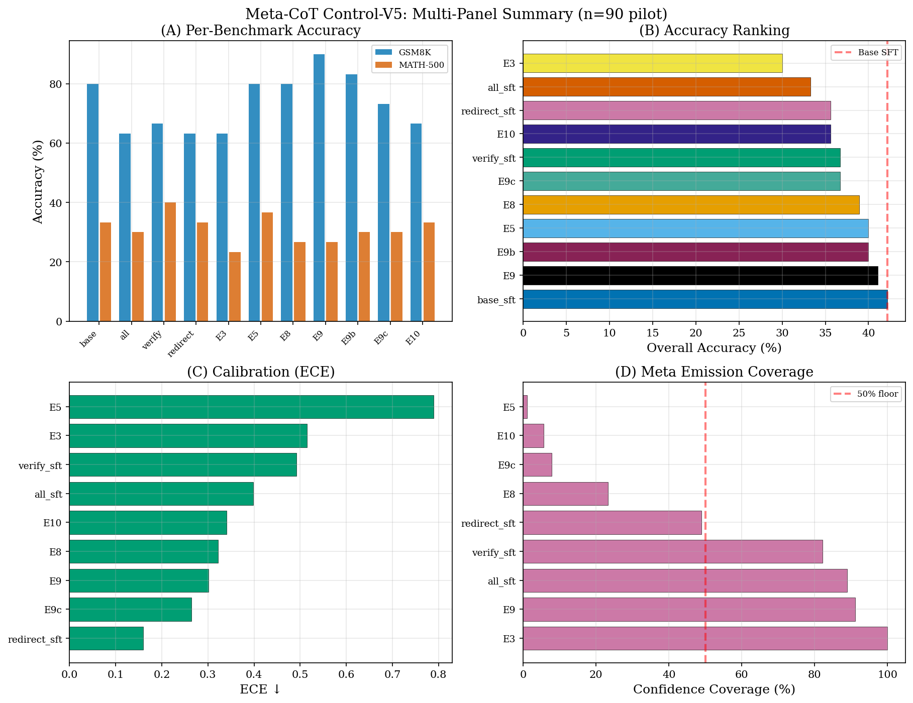
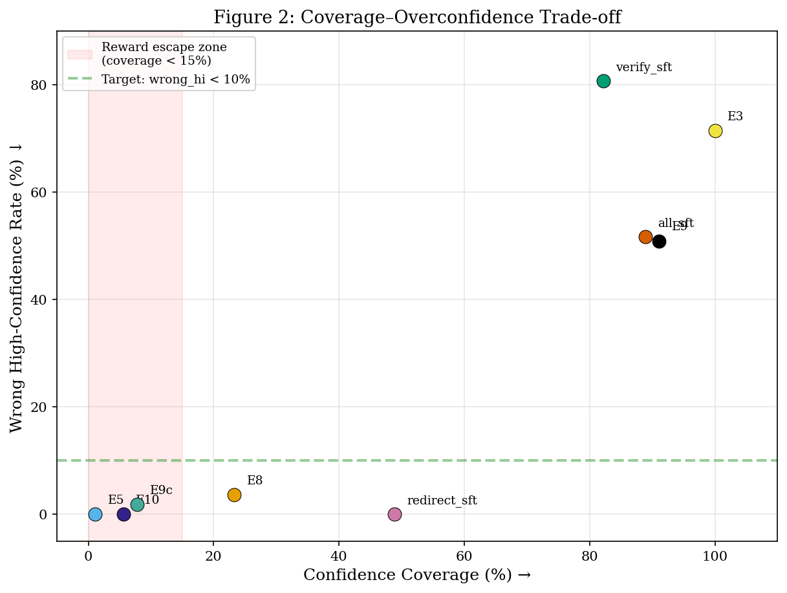
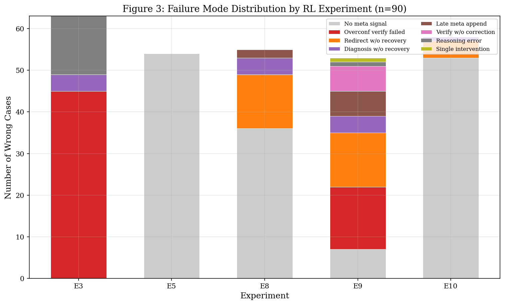

# Meta-CoT Control-V5: From Metacognitive Detection to Execution

**Author:** Seungpil Lee  
**Date:** 2026-04-04  
**Source data:** `control_v5_eval_readout_2026_04_04.md`, `failure_analysis_2026_04_04.json`

---

## Executive Summary

The Control-V5 experiment series trains Qwen3-8B to emit structured metacognitive control signals (`<|meta|>` blocks containing verify, redirect, and diagnosis actions with calibrated confidence) and evaluates whether these signals translate into measurable out-of-distribution (OOD) test-time adaptation gains. Eleven model variants---three SFT ablations and eight RL configurations (E3 through E10)---were evaluated on a pilot set of 90 problems (30 AIME 2024, 30 GSM8K, 30 MATH-500).

| Model | Acc | ECE | Conf_Cov | Wrong_Hi | Key Observation |
|---|---|---|---|---|---|
| base_sft | 42.2 | n/a | 0.0 | n/a | No meta signals; accuracy baseline |
| E9 | 41.1 | 0.301 | 91.1 | 50.9 | Highest accuracy among meta models; verify is decorative |
| E8 | 38.9 | 0.322 | 23.3 | 3.6 | Overconfidence suppression works; low coverage limits scope |
| E5 | 40.0 | 0.790 | 1.1 | 0.0 | Near-zero meta emission; reward escape via omission |

**Conclusion.** Meta-CoT signals are parseable and trainable via reward shaping, but the current generation of rewards does not produce functional test-time controllers. The primary bottleneck has shifted from meta detection to meta execution: models diagnose weaknesses but fail to act on them. Three targeted fixes---same-route repetition penalty, route-switch evidence reward, and confidence omission floor---are proposed for the next round.

---

## 1. Background and Intent

### 1.1 Definition: Meta-CoT

Meta-CoT is a structured reasoning protocol in which a language model interleaves standard chain-of-thought computation with explicit metacognitive control blocks delimited by `<|meta|>` and `<|/meta|>` tokens. Each meta block contains three fields:

- **confidence:** a scalar in [0, 1] representing the model's posterior belief in the current solution route.
- **assessment:** a natural-language diagnosis of why the current route may be incorrect.
- **action:** one of {verify, redirect, diagnose}, specifying the next controller step.

The term **controller** refers to the decision function that maps the current reasoning state to one of these actions. A functional controller would (a) detect when confidence is unjustified, (b) invoke verify with an independent check rather than a paraphrase, and (c) execute redirect by switching the solution route when diagnosis indicates a dead end.

### 1.2 Research Questions

This study addresses three research questions:

- **RQ1 (Parseability and Adaptation):** Can Meta-CoT teach a parseable controller state that enables OOD test-time adaptation?
- **RQ2 (Learnability via Rewards):** Can Meta-RL make verify, redirect, and diagnosis behaviors learnable through reward decomposition?
- **RQ3 (Curriculum Extensibility):** Can curriculum learning or retrieval-augmented generation (RAG) extend from reliable diagnosis to improved performance?

### 1.3 Experimental Context

All models are fine-tuned from a Qwen3-8B base. SFT variants use supervised fine-tuning on 4,996 Meta-CoT chains generated by GPT-5.4-mini. RL variants apply Group Relative Policy Optimization (GRPO) with decomposed reward functions targeting specific metacognitive behaviors. Evaluation uses `max_tokens=4096` to avoid confounding from truncation.

---

## 2. Experiment Design

### 2.1 Reward Decomposition Contract

The RL experiments form a progression from broad reward to targeted component rewards. Each experiment isolates a specific hypothesis about which reward signal drives functional metacognitive behavior.

#### E3: Full Meta + Correctness + Calibration

- **Intent:** Combine all reward components (correctness, meta presence, confidence calibration) to train a fully metacognitive model.
- **Hypothesis:** Joint optimization over all signals will produce an emergent controller.
- **Verification criterion:** Accuracy >= base_sft; ECE < 0.3; Wrong_Hi < 20%.

#### E5: Correctness-Only RL (Meta-Free Baseline)

- **Intent:** Train with correctness reward only, removing all meta-related rewards, to establish an RL baseline without metacognitive pressure.
- **Hypothesis:** Without meta rewards, the model will not emit meta blocks but may preserve or improve accuracy.
- **Verification criterion:** Accuracy >= base_sft; Conf_Cov near 0 (confirming no meta pressure).

#### E8: Overconfidence Penalty + Correctness

- **Intent:** Add a penalty for high-confidence wrong answers on top of correctness reward.
- **Hypothesis:** Penalizing overconfidence will suppress Wrong_Hi without destroying accuracy.
- **Verification criterion:** Wrong_Hi < 10%; Accuracy within 3 points of base_sft.

#### E9: Verify Reward + Correctness

- **Intent:** Add a reward for verify actions when the model's first answer is uncertain (confidence < threshold).
- **Hypothesis:** Rewarding verify will increase verification frequency and improve accuracy on problems where initial reasoning is weak.
- **Verification criterion:** Conf_Cov > 80%; accuracy improvement on AIME.

#### E9b: E9 Variant without Confidence Reward

- **Intent:** Remove the calibration component from E9 to test whether verify alone (without confidence signal) produces functional self-checking.
- **Hypothesis:** Without calibration pressure, the model may still verify but will not emit confidence.
- **Verification criterion:** Accuracy >= E9; Conf_Cov near 0 (expected, since no calibration reward).

#### E9c: E9 with Confidence Floor

- **Intent:** Add a minimum confidence coverage constraint to E9 to prevent confidence omission.
- **Hypothesis:** A coverage floor will force the model to emit confidence while retaining verify behavior.
- **Verification criterion:** Conf_Cov > 50%; Wrong_Hi < E9.

#### E10: Full Controller Reward (Verify + Redirect + Diagnosis)

- **Intent:** Combine verify, redirect, and diagnosis rewards with correctness to train a complete metacognitive controller.
- **Hypothesis:** The full reward stack will produce a model that detects, diagnoses, and recovers from reasoning errors.
- **Verification criterion:** Accuracy >= base_sft; at least 3 failure modes represented; diagnosis-to-recovery rate > 50%.

### 2.2 SFT Ablations

Three SFT ablations isolate the contribution of each meta action type in the training data:

| Model | Training Data |
|---|---|
| all_sft | Full Meta-CoT chains with verify + redirect + diagnosis |
| verify_sft | Chains containing only verify meta blocks |
| redirect_sft | Chains containing only redirect meta blocks |

---

## 3. Quantitative Results

### 3.1 Control-V5 Pilot (n=90, 30 per benchmark)

(source: control_v5_eval_readout_2026_04_04.md)

| Model | Acc | AIME | GSM8K | MATH500 | Conf_Cov | ECE | Wrong_Hi |
|---|---|---|---|---|---|---|---|
| base_sft | 42.2 | 13.3 | 80.0 | 33.3 | 0.0 | n/a | n/a |
| all_sft | 33.3 | 6.7 | 63.3 | 30.0 | 88.9 | 0.398 | 51.7 |
| verify_sft | 36.7 | 3.3 | 66.7 | 40.0 | 82.2 | 0.492 | 80.7 |
| redirect_sft | 35.6 | 10.0 | 63.3 | 33.3 | 48.9 | 0.160 | 0.0 |
| E3 | 30.0 | 3.3 | 63.3 | 23.3 | 100.0 | 0.515 | 71.4 |
| E5 | 40.0 | 3.3 | 80.0 | 36.7 | 1.1 | 0.790 | 0.0 |
| E8 | 38.9 | 10.0 | 80.0 | 26.7 | 23.3 | 0.322 | 3.6 |
| E9 | 41.1 | 6.7 | 90.0 | 26.7 | 91.1 | 0.301 | 50.9 |
| E9b | 40.0 | 6.7 | 83.3 | 30.0 | 0.0 | n/a | n/a |
| E9c | 36.7 | 6.7 | 73.3 | 30.0 | 7.8 | 0.264 | 1.8 |
| E10 | 35.6 | 6.7 | 66.7 | 33.3 | 5.6 | 0.340 | 0.0 |

**Key observations:**

1. No meta model exceeds base_sft accuracy (42.2). The highest meta model is E9 at 41.1, a gap of 1.1 percentage points.
2. E8 achieves the target of Wrong_Hi < 10% (3.6) while maintaining accuracy within 3.3 points of base_sft. This is the only RL experiment that meets its verification criterion on the overconfidence dimension.
3. E3 shows the worst accuracy (30.0) despite 100% confidence coverage, indicating that joint optimization without targeted reward decomposition produces overconfident, inaccurate models.
4. E5, E9b, and E10 have confidence coverage below 10%, rendering their calibration metrics unreliable.

### 3.2 Per-Benchmark Breakdown

#### AIME 2024 (n=30 per model)

| Model | AIME Acc |
|---|---|
| base_sft | 13.3 |
| all_sft | 6.7 |
| verify_sft | 3.3 |
| redirect_sft | 10.0 |
| E3 | 3.3 |
| E5 | 3.3 |
| E8 | 10.0 |
| E9 | 6.7 |
| E9b | 6.7 |
| E9c | 6.7 |
| E10 | 6.7 |

AIME is the hardest benchmark, and meta overhead appears to actively harm performance. Only base_sft achieves 13.3, with E8 and redirect_sft closest at 10.0. The verify-heavy models (verify_sft, E3) score the lowest (3.3), suggesting that verify behavior on hard problems is counterproductive when it consists of same-route repetition.

#### GSM8K (n=30 per model)

| Model | GSM8K Acc |
|---|---|
| base_sft | 80.0 |
| E9 | 90.0 |
| E5 | 80.0 |
| E8 | 80.0 |
| E9b | 83.3 |
| E9c | 73.3 |
| E10 | 66.7 |
| verify_sft | 66.7 |
| all_sft | 63.3 |
| redirect_sft | 63.3 |
| E3 | 63.3 |

E9 achieves 90.0 on GSM8K, the highest score in the entire pilot. This indicates that verify rewards can improve performance on easier problems where self-checking catches arithmetic errors. However, the same E9 model scores only 26.7 on MATH-500, suggesting that verify behavior does not transfer to harder reasoning tasks.

#### MATH-500 (n=30 per model)

| Model | MATH500 Acc |
|---|---|
| verify_sft | 40.0 |
| E5 | 36.7 |
| base_sft | 33.3 |
| redirect_sft | 33.3 |
| E10 | 33.3 |
| all_sft | 30.0 |
| E9b | 30.0 |
| E9c | 30.0 |
| E8 | 26.7 |
| E9 | 26.7 |
| E3 | 23.3 |

MATH-500 results show no consistent benefit from meta signals. Verify_sft achieves the highest score (40.0), but this may reflect data selection bias rather than functional metacognition.

### 3.3 Large-Scale Reference (1,030 problems, previous round)

(source: control_v5_eval_readout_2026_04_04.md)

| Model | Overall Accuracy |
|---|---|
| Base SFT | 71.7% |
| V2 SFT | 72.72% |
| V3 SFT | 72.0% |
| E5 | 72.04% |
| E8 | 67.2% |

At full scale, E5 (correctness-only RL) matches V2 SFT, confirming that RL without meta rewards preserves accuracy. E8 drops to 67.2%, indicating that overconfidence penalty has a cost on easier problems that dominate the larger benchmark set.

---

## 4. Qualitative Failure Analysis

Failure modes were identified by manual inspection of wrong-answer completions. Counts are aggregated from `failure_analysis_2026_04_04.json` (source: failure_analysis_2026_04_04.json).

### 4.1 Overconfident Verify Failed

**Affected models:** E3 (45 cases), E9 (15 cases), verify_sft

**Pattern:** The model completes an initial solution, emits a meta block stating "single route, should verify," then re-derives the same calculation using identical assumptions. Confidence remains high (typically 0.86--0.89) throughout. The verification step produces a paraphrase of the original reasoning rather than an independent falsification.

**Concrete example (E3, GSM8K, "sheep counting"):**

The model computes Toulouse = 2 * Charleston = 2 * (4 * 20) = 160, total = 320. The first meta block states: "confidence: 0.88. The answer came quickly from a single straightforward chain, so my confidence may be running a bit ahead of the support. I should do a brief independent check." The subsequent verification recalculates the same chain: 20 + 80 + 160 = 320. A second meta block states: "confidence: 0.87. The check is good." The answer remains 320 (wrong; correct answer is 260, since Toulouse = 2 * 80 = 160, Charleston = 80, Seattle = 20, total = 260).

**Concrete example (E9, AIME 540):**

The meta block states: "verify whether simultaneous maximization holds." The subsequent text repeats the same extremal-value intuition and retains the answer 324.

**Root cause:** The verify reward triggers on the presence of verification language, not on the independence or correctness of the verification content. The model learns to emit verify tokens without learning to falsify.

**Failure count breakdown (E3):** overconfident_verify_failed=45, reasoning_error_after_control=14, diagnosis_without_recovery=4.

**Failure count breakdown (E9):** overconfident_verify_failed=15, single_redirect_without_recovery=13, no_meta_signal=7, late_meta_append=6, single_verify_without_correction=6, diagnosis_without_recovery=4.

### 4.2 Diagnosis Without Recovery

**Affected models:** E8 (4 cases), E10 (1 case), E3 (4 cases)

**Pattern:** The meta block correctly identifies the weakness of the current approach and specifies a `study_need` (e.g., "orbit/cyclic counting," "inclusion-exclusion structure"). However, the subsequent reasoning continues along the original route without executing the prescribed switch.

**Concrete example (E10, AIME "Aimeville sets"):**

Meta block: "confidence: 0.34. The direct overlap-counting route is getting brittle: it treats the exact-two and exact-three counts as if they can be applied independently, but that independence does not exist. study_need: inclusion-exclusion structure for overlapping category counts. I should stop pushing ad hoc overlaps and switch to a structured inclusion-exclusion count."

Subsequent reasoning: "The number who own exactly 2 + exactly 3 + exactly 4 = 900. Thus: 437 + 234 + x = 900. x = 229." The model produces 229 (wrong; correct answer is 73). No inclusion-exclusion is attempted despite the explicit diagnosis.

**Concrete example (E8, AIME "octagon coloring"):**

Meta block diagnoses the need for orbit/cyclic counting. The subsequent reasoning continues with inaccurate case enumeration and produces 535.

**Root cause:** The redirect reward credits diagnosis text (study_need emission) but does not require evidence of route switching in the subsequent computation. The model learns to diagnose without learning to act.

### 4.3 Single Intervention Only

**Affected models:** all_sft, E8 (36 no_meta_signal + 13 single_redirect_without_recovery), E10

**Pattern:** A single meta block appears early in the completion. No further metacognitive monitoring follows, even on hard problems where repeated self-correction would be expected. The meta block functions as a one-shot comment rather than an ongoing controller loop.

**Failure count breakdown (E8):** no_meta_signal=36, single_redirect_without_recovery=13, diagnosis_without_recovery=4, late_meta_append=2.

**Failure count breakdown (E10):** no_meta_signal=53, single_redirect_without_recovery=4, diagnosis_without_recovery=1.

**Root cause:** Current reward functions do not explicitly incentivize repeated intervention. A model that emits one meta block early in the trajectory receives the same meta-presence reward as one that monitors throughout. Hard problems (particularly AIME) require iterative monitoring, but the reward structure does not differentiate.

### 4.4 Reward Escape via Confidence Omission

**Affected models:** E5 (54 cases), E10 (53 cases)

**Pattern:** The model produces wrong answers with no meta blocks and no confidence scores. With confidence coverage near zero (E5: 1.1%, E10: 5.6%), calibration metrics become uninterpretable. The model has learned that omitting confidence entirely avoids calibration penalties.

**Failure count breakdown (E5):** no_meta_signal=54 (all wrong cases).

**Failure count breakdown (E10):** no_meta_signal=53, single_redirect_without_recovery=4, diagnosis_without_recovery=1.

**Concrete example (E5, GSM8K, "house flipping"):**

The completion contains no `<|meta|>` blocks. The model computes the value increase as 150% of $80,000 = $120,000, then new value = $80,000 + $120,000 = $200,000, but applies a 3.5x multiplier instead, arriving at $280,000 and a profit of $150,000. No confidence is emitted, so the wrong answer carries no calibration signal.

**Root cause:** The reward function penalizes miscalibrated confidence but does not penalize the absence of confidence. This creates an escape route: the model can minimize calibration loss by minimizing confidence emission rather than by improving calibration quality.

---

## 5. Hypothesis Evaluation

### 5.1 RQ1: Can Meta-CoT teach parseable controller state for OOD test-time adaptation?

**Verdict: Weak support.**

Meta blocks are parseable across all meta-emitting models. The `<|meta|>` format is consistently structured with confidence, assessment, and action fields. SFT successfully instills the syntactic convention, and RL maintains it.

However, parseability does not imply functionality. No meta model exceeds base_sft accuracy (42.2 vs. best meta model 41.1). OOD adaptation---defined as improved performance on problems harder than the training distribution---is not demonstrated. AIME accuracy is lower for nearly all meta models compared to base_sft (13.3). The controller state is syntactically present but semantically inert.

**Evidence:**

- base_sft accuracy: 42.2. Best meta model (E9): 41.1. (source: control_v5_eval_readout_2026_04_04.md)
- AIME accuracy: base_sft 13.3 vs. E8 10.0 (best meta), E3/E5/verify_sft 3.3 (worst).
- Failure analysis: verify blocks repeat the same route (Section 4.1); redirect blocks diagnose but do not execute (Section 4.2).

### 5.2 RQ2: Can Meta-RL make verify/redirect/diagnosis learnable via rewards?

**Verdict: Partial support.**

The evidence is mixed across the three controller actions:

**Verify (partial).** E9 achieves 90.0 on GSM8K (vs. 80.0 base_sft), indicating that verify rewards can improve self-checking on arithmetic problems. However, E9's Wrong_Hi remains at 50.9, meaning that when the model is wrong, it is often confidently wrong. Verify is decorative in the sense that it increases verification frequency without increasing verification quality.

**Overconfidence suppression (supported).** E8 reduces Wrong_Hi from n/a (base_sft has no confidence) to 3.6, meeting its verification criterion. This is the clearest positive result. However, E8 achieves this partly by reducing confidence coverage to 23.3%, so the low Wrong_Hi reflects selective confidence emission as much as improved calibration.

**Redirect and diagnosis (not supported).** E10 was designed to train the full controller stack. Its accuracy (35.6) is below base_sft (42.2), its confidence coverage is 5.6%, and 53 of 58 wrong answers contain no meta signal. The full controller reward does not produce functional redirect or diagnosis behavior.

**Evidence:**

- E8 Wrong_Hi = 3.6 (meets < 10% criterion). (source: control_v5_eval_readout_2026_04_04.md)
- E9 GSM8K = 90.0 (best in pilot), but Wrong_Hi = 50.9.
- E10 accuracy = 35.6; no_meta_signal = 53 of 58 wrong cases. (source: failure_analysis_2026_04_04.json)

### 5.3 RQ3: Can curriculum/RAG extend from reliable diagnosis?

**Verdict: Gated. Diagnosis quality is insufficient for curriculum.**

Curriculum learning and RAG both depend on the quality of `study_need` fields as retrieval triggers. The current data shows that study_need is generated in diagnosis-without-recovery cases (Section 4.2), and the diagnoses are often topically correct (e.g., "inclusion-exclusion structure," "conjugate-based approach"). However, the model does not act on these diagnoses, so their downstream utility is unverified.

Deploying RAG on the current diagnosis quality risks creating a system where retrieval is triggered by uncertainty rather than by a specific, actionable knowledge gap. This would degenerate into "uncertain -> retrieve" rather than "diagnosed gap -> retrieve targeted material."

**Evidence:**

- E3 diagnosis_without_recovery = 4; E8 diagnosis_without_recovery = 4; E10 diagnosis_without_recovery = 1. (source: failure_analysis_2026_04_04.json)
- Study_need fields in E10 completions are topically appropriate but not acted upon (Section 4.2).
- Curriculum gating is maintained until diagnosis-to-recovery rate exceeds 50%.

---

## 6. Proposed Improvements

### 6.1 Fix 1: Same-Route Repetition Penalty (Verify Quality)

**Problem:** Verify blocks repeat the original calculation rather than providing an independent check. 45 of 63 wrong answers in E3 and 15 of 53 in E9 exhibit this pattern. The verify reward credits verification presence without distinguishing paraphrase from falsification.

**Solution:** Add a same-route repetition penalty computed by measuring n-gram overlap between the text before and after the verify meta block. If the cosine similarity between pre-verify and post-verify reasoning exceeds a threshold (e.g., 0.85), apply a negative reward proportional to the excess similarity.

**Expected effect:** Models will be incentivized to produce verification text that is lexically and structurally distinct from the original reasoning. This should shift verify from paraphrase to independent cross-check, reducing overconfident_verify_failed cases.

### 6.2 Fix 2: Route-Switch Evidence Reward (Redirect Execution)

**Problem:** Redirect meta blocks produce correct diagnoses (study_need) but the subsequent reasoning continues along the original route. The current redirect reward credits study_need emission without requiring execution.

**Solution:** Add a route-switch evidence reward that detects whether the computation after a redirect meta block introduces new mathematical operations, variables, or structural approaches that were absent before the meta block. This can be implemented as a keyword or operation-set difference metric between pre-redirect and post-redirect reasoning.

**Expected effect:** Models will be incentivized to actually switch approaches after diagnosing a dead end, converting diagnosis_without_recovery cases into functional redirects.

### 6.3 Fix 3: Confidence Omission Floor (Prevent Reward Escape)

**Problem:** E5 and E10 minimize calibration loss by omitting confidence entirely (coverage 1.1% and 5.6% respectively). 54 of 54 wrong answers in E5 and 53 of 58 in E10 have no meta signal.

**Solution:** Introduce a confidence omission floor: if confidence coverage falls below a minimum threshold (e.g., 30%), apply a per-sample penalty for each completion that lacks a confidence score. The penalty should be large enough to dominate the calibration reward savings from omission.

**Expected effect:** Models will be forced to emit confidence scores, making calibration metrics interpretable and enabling the overconfidence penalty (Fix 1) to operate across the full answer distribution.

---

## 7. Next Experiments

### 7.1 E9v2: Verify with Repetition Penalty

Applies Fix 1 (same-route repetition penalty) to the E9 reward stack. The hypothesis is that verify quality will improve, reducing Wrong_Hi from 50.9 while maintaining the GSM8K accuracy advantage (90.0).

**Success criterion:** Wrong_Hi < 30%; GSM8K accuracy >= 85%.

### 7.2 E9bv2: Verify + Confidence Floor

Applies Fix 3 (confidence omission floor) to the E9b configuration. E9b currently has 0.0% confidence coverage, making calibration unmeasurable. The hypothesis is that forcing confidence emission will enable meaningful calibration evaluation without destroying accuracy.

**Success criterion:** Conf_Cov >= 30%; accuracy >= 38%.

### 7.3 E10v2: Full Controller with Execution Rewards

Applies all three fixes (repetition penalty, route-switch evidence, omission floor) to the E10 full controller stack. This is the critical test of whether decomposed execution rewards can produce a functional metacognitive controller.

**Success criterion:** Accuracy >= base_sft (42.2); at least 2 of 4 failure modes reduced by >= 50%.

### 7.4 Full-Scale Evaluation Plan

Models meeting pilot success criteria will proceed to the full 1,030-problem evaluation (GSM8K 500, MATH-500 500, AIME 2024 30). The primary comparison will be E9v2 vs. base_sft on overall accuracy, with secondary comparisons on ECE, Wrong_Hi, and per-benchmark breakdown. The 1,030 evaluation will use the same `max_tokens=4096` setting and deterministic decoding (temperature=0) as the pilot.

---

## References

- **Figure 1:** Accuracy-Calibration Trade-off. `figures/fig1_accuracy_vs_ece.png`. Plots overall accuracy against ECE for all models with ECE defined (Conf_Cov > 0).
- **Figure 2:** Coverage vs. Wrong High-Confidence. `figures/fig2_coverage_vs_wrong_hi.png`. Shows the relationship between confidence coverage and the proportion of wrong answers with high confidence.
- **Figure 3:** Failure Mode Distribution. `figures/fig3_failure_modes.png`. Bar chart of failure mode counts across E3, E5, E8, E9, and E10.
- **Figure 4:** AIME Behavior Across Models. `figures/fig4_aime_behavior.png`. Per-model AIME accuracy with annotation of dominant failure mode.
- **Figure 5:** Multi-Panel Summary. `figures/fig5_multipanel_summary.png`. Four-panel figure combining accuracy, ECE, coverage, and Wrong_Hi across all models.

---

*All numerical results in this document are drawn from the Control-V5 pilot evaluation (n=90, 30 per benchmark) unless otherwise noted. (source: control_v5_eval_readout_2026_04_04.md)*
