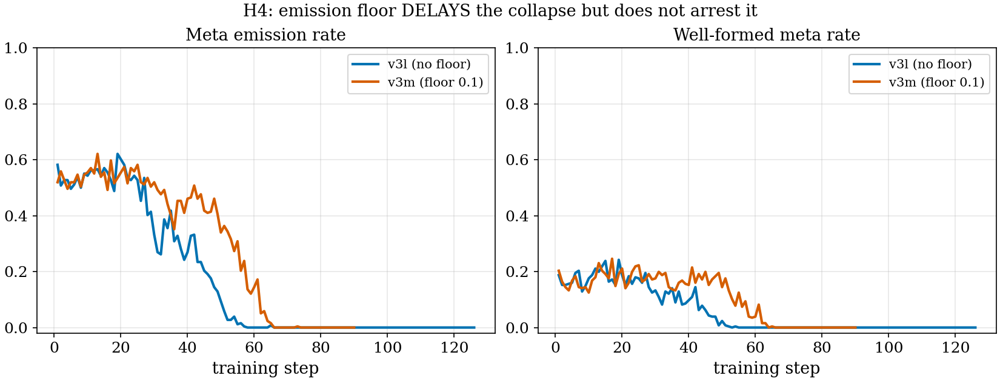
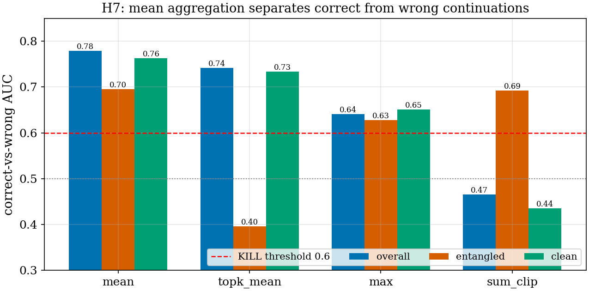
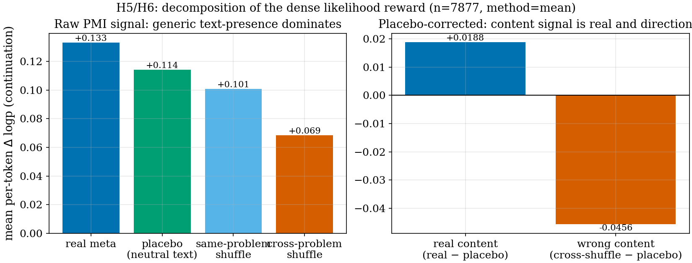
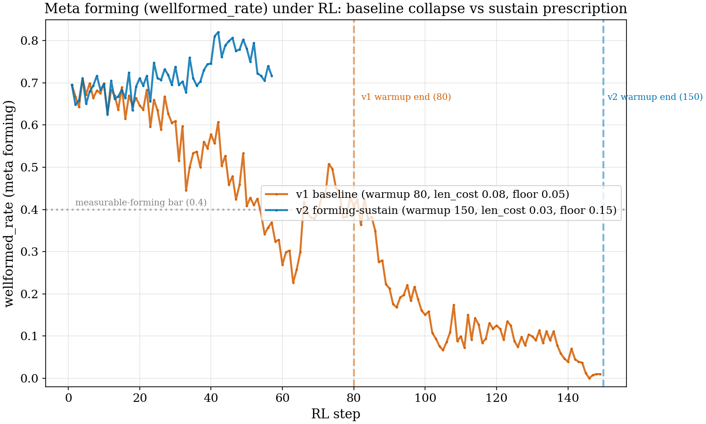
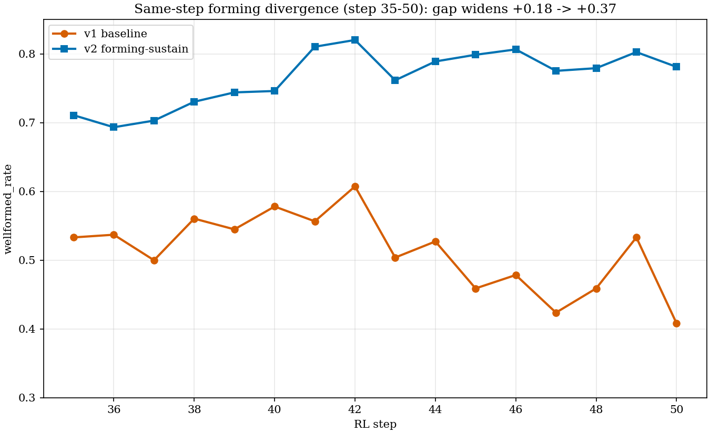
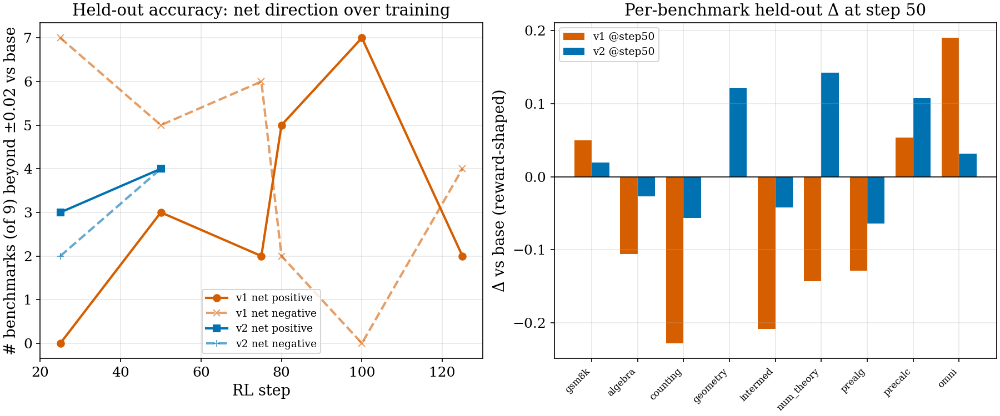

# Region-Routed Metacognition RL (DCPO v2→v4): Hypothesis–Verification Study

**Author**: autoresearch loop (Claude) **Date**: 2026-06-11 **Project**: metacognition-math, branch `ctsd-phase-c`
**Reviewed sources**: wandb group `triobj_dcpo_v3*` (runs `adf1a0fc` v3l, `daa6d35a` v3m), `/tmp/probe_pmi_report.json`, `/tmp/probe_pmi_cross_report.json`, `docs/dcpo_v3_design_and_status.md`, spec `docs/superpowers/specs/2026-06-11-dcpo-v4-likelihood-rmeta-design.md`

## Executive Summary

| Question | Experiment | Result | Verdict |
|---|---|---|---|
| Does a causal counterfactual reward teach the value of meta? | v3 (CF 2nd generation) | acc(with-meta) − acc(without-meta) ≈ 0 on-policy → no learnable gap | signal too **sparse** |
| Does the format penalty cause meta mode collapse? | v3l | meta emission 0.5 → 0.0 by step ~60 | **confirmed** (collapse engine) |
| Does an emission floor prevent the collapse? | v3m (floor 0.1) | collapse **delayed 8–12 steps**, then total (0 by step 66) | floor = delay, **not arrest** |
| Does a dense likelihood reward (PMI) carry signal? | v4 offline probe, n=7,877 | real beats placebo t=17.9, p≈10⁻⁷²; AUC 0.78 | **yes, but** … |
| …is the raw signal content-specific? | cross-shuffle probe | placebo retains **86%**, cross-problem meta retains 52% | **no — generic-text dominated** |
| Is there a real content signal under the generic component? | placebo-corrected aggregate | right content **+0.019**, wrong content **−0.046** (vs placebo) | **yes, small, directional** |

**Conclusion in one sentence**: sparse correctness-difference rewards cannot teach metacognition (no gap to learn from), raw dense likelihood rewards mostly pay for *emitting any text*, and the trainable signal is the **placebo-corrected content increment** — small, highly significant, and direction-correct — which v4 stage-2 now adopts as its reward.

---

## 1. Background and Intent

### 1.1 What we are trying to do

**Meta-CoT** is a math-reasoning format in which the model externalizes metacognition inside `<|meta|> … <|/meta|>` blocks (self-checks, strategy switches, confidence statements) during its chain of thought. The north-star (CLAUDE.md, 2026-06-07) is: **metacognitive behavior is a *means* to accuracy, not the goal** — RL must selectively reinforce *useful* metacognition, with calibration only a sub-goal.

**DCPO** (our method line) is region-routed RL: each response is partitioned into disjoint token regions — ANSWER (reasoning + final answer), META_CONTENT (text inside meta tags), CONF (the confidence number) — and each region receives its **own** reward head (R_corr / R_meta / R_cal, plus a format head), centered per head with Dr.GRPO group-mean subtraction. Routing is the part that *works* and survives every redesign below; what changed version to version is **what R_meta measures**.

### 1.2 The central difficulty

R_meta must answer: *"did this meta block actually help the solution?"* Versions differ in how they estimate that:

- **v2**: transition-table proxy (did the answer flip after the meta?) — gameable, replaced.
- **v3 (v3a–v3m)**: causal counterfactual — regenerate the same rollout with meta suppressed, reward the correctness difference `c_with − c_without ∈ {−1, 0, +1}`.
- **v4**: dense likelihood (PMI) — how much does the meta block raise the model's own probability of its own subsequent reasoning, `Δₜ = log P_ref(Cₜ | prefix+meta+C₍₍ₜ₎₎) − log P_ref(Cₜ | prefix+C₍₍ₜ₎₎)`, scored by a frozen SFT reference at T=1 (design adopted from RLT, arXiv:2506.08388, after user feedback).

---

## 2. Hypotheses and Verification

### H2 — "A causal counterfactual reward provides a learnable signal" → SPARSE (falsified in practice)

The v3 counterfactual machinery itself was made to work: the CF generation initially produced *meta-signature* echoes that leaked the suppressed meta back into the counterfactual; after signature suppression the gradable CF fraction (`dcpo/cw_graded_rate`) rose from ~0.11 (v3l, steps 11–19) to **0.488** at v3m step 1 (v3m config `dcpo_cf_suppress_signature: true`; source: wandb runs `adf1a0fc`/`daa6d35a`). But the measured quantity was then ≈ 0: on-policy, **accuracy with meta minus accuracy without meta showed no exploitable gap**, so R_meta was a coin flip on most rows and silent on the rest. A reward that is almost always 0 or noise cannot teach *why* meta helps. This is the direct motivation for a **dense** reward (v4): instead of one ±1 bit per rollout requiring a second generation, score every continuation token's likelihood shift in one reference forward pass.

### H3 — "The format penalty is the collapse engine" → CONFIRMED (v3l)

v3l added a format-violation penalty alongside the meta heads. Meta emission fell from ~0.5 to **0.0 by step ~60** (Figure 1, blue; wandb run `adf1a0fc`, `dcpo/meta_emit_rate`). The mechanism: when emitting meta risks a format penalty but emitting *no* meta risks nothing, the cheapest policy is silence. The policy found it reliably.

### H4 — "An un-centered emission floor prevents collapse" → DELAY, NOT ARREST (v3m)

v3m added `dcpo_meta_floor: 0.1`: a small positive reward for emitting trusted-class meta, added **after** Dr.GRPO centering (a pre-centering constant cancels in the group mean), per-row normalized (length-neutral), restricted to TRUSTED meta classes.



**Figure 1 interpretation**: both runs start at ~0.5–0.6 emission. v3l (blue) collapses through steps 30–55, falls below 0.05 at step 52 and reaches 0 at step 58. v3m (orange) holds a plateau near 0.4–0.5 longer, falls below 0.05 at step 64 and reaches 0 at step 66 — a delay of **8 steps by first-zero, 12 steps by the 0.05 threshold** (source: wandb `dcpo/meta_emit_rate`, runs `adf1a0fc`/`daa6d35a`). The well-formed rate (right) tells the same story at lower amplitude. **A floor changes the collapse *schedule*, not the equilibrium**: as long as the *content* reward on meta is noise (H2), any competing pressure (format risk, length cost) eventually wins. The fix must make meta content *worth something*, which is exactly H5–H7.

### H5 — "Dense likelihood delta carries decision-relevant signal" → YES (probe, with caveats below)

The v4 kill-or-go offline probe scored 7,877 guard-filtered rollouts (8,024 parsed, from `e8_goldfree_1030_16k_k8`; v8_strict SFT as frozen scorer) in three arms: **real** (the model's own meta at its native position), **placebo** (the meta replaced by a contentless `"Let me continue."` wrapped in tags), **shuffle** (the meta replaced by another rollout's meta). Three pre-registered kill criteria:

1. **Placebo**: real must beat placebo, paired one-sided t. Result: t=17.9, p≈9.6×10⁻⁷² for the `mean` aggregation (source: `/tmp/probe_pmi_cross_report.json` `placebo.mean`). **PASS** — decisive across all four aggregations (t 10–52).
2. **AUC**: per-row Δ-aggregate must separate correct from wrong continuations, AUC > 0.6 on the *entangled* split. Result: `mean` AUC **0.779 overall / 0.696 entangled (n=160) / 0.763 clean** (source: same file, `auc.mean`). **PASS** (Figure 3).
3. **Shuffle**: replacing the meta with someone else's must collapse Δ toward 0 (ratio < 0.25). Result: **FAIL twice** — and the *way* it failed is the most informative finding of the study (H6).



**Figure 3 interpretation**: `mean` (per-token average delta) dominates on every split and is the only method above the 0.6 kill line on all three; `sum_clip` is below 0.5 overall (worse than chance — long metas accumulate negative tails). The probe therefore froze `dcpo_pmi_agg: mean`, `clip_c = 0.342` (p95 of |Δ|) into the stage-2 config (commit 4b169dd).

### H6 — "The shuffle failure is a sibling-duplication confound" → HALF-TRUE, and the half that failed is a discovery

First probe shuffled **within problem** (sibling rollouts of the same question): collapse ratio **0.758** — barely collapsed (source: `/tmp/probe_pmi_report.json` `shuffle.mean.collapse_ratio`). Diagnosis: siblings share most of their solution (measured continuation similarity ~0.49, near-verbatim pairs common), so swapping their metas barely changes content — the criterion, not the signal, looked broken. The disambiguation re-test shuffled **across problems**: collapse ratio fell to **0.516** (source: `/tmp/probe_pmi_cross_report.json` `shuffle.mean.collapse_ratio`). So the confound is real (0.76 → 0.52) — but half the signal survives a meta from a *different problem*, which no content-specific signal should.



**Figure 2 interpretation (left)**: mean per-token Δ is **+0.133** with the real meta, **+0.114** with a contentless placebo, **+0.101** with a same-problem sibling's meta, **+0.069** with a different problem's meta (sources: cross report `delta_stats.mean.mean`, `placebo.mean.mean_placebo`, first report `shuffle.mean.mean`, cross report `shuffle.mean.mean`). The placebo bar is the discovery: **86% of the raw reward is "some text is present here"** — a generic component that any meta-shaped interruption earns. An RL policy paid with raw Δ would learn to emit meta-shaped *anything*: exactly the mashing failure v3 fought.

**Figure 2 interpretation (right)**: subtracting the placebo per row isolates the content increment: the right content adds **+0.0188** (t=17.9), the wrong content **−0.0456** — *worse than saying nothing meaningful*. The content signal is small but real and **directional**: it rewards correct-content meta and punishes wrong-content meta, which is precisely the gradient a metacognition reward should carry.

### H7 — "The placebo-corrected delta Δ′ = Δ − Δ_placebo passes the full battery" → aggregate-level YES; per-row verdict PENDING

At the aggregate level the corrected metric collapses under cross-shuffle by construction of the numbers above (+0.0188 → −0.0456 is a sign flip, not a mere shrink). The probe was extended (commit 4ad8a09) with a dedicated `verdict_corrected` battery — corrected mean>0 paired-t, corrected AUC, corrected shuffle where the **shuffle arm is also placebo-subtracted** — plus a per-row dump so any future metric variant can be graded without the ~95-minute GPU re-scoring pass. The per-row corrected probe is running; the open risk is the corrected **AUC**: subtracting placebo removes a component that may itself correlate with correctness, so AUC could drop below 0.6. Decision rule pre-registered: PASS → stage-2 ships Δ′; corrected-AUC FAIL → stop and re-decide (raw Δ + group-centering argument vs. stage-1-only).

---

## 3. Implementation Structure (what stage-1/2 actually run)

```text
response tokens:  <think> ... <|meta|> META_CONTENT (CONF) <|/meta|> ... ANSWER
mask partition:   ANSWER_REGION | META_CONTENT∖CONF | CONF | FORMAT_* (disjoint, asserted)
reward heads:     R_corr(w=1.0)→ANSWER   R_meta(w=0.5, stage-2 only)→META∖CONF
                  R_cal Brier(w=0.3, stage-2)→CONF   R_format(w=0.1)→FORMAT
centering:        Dr.GRPO per-head group-mean subtract over member rows
floor (v3m, kept): +0.1 un-centered AFTER centering, row-normalized, trusted classes
```

Stage-1 (`triobj_dcpo_v4_stage1_h100_4x4k`, **launched 2026-06-11, running**): R_corr + floor + R_format only — `dcpo_rmeta_source: none`. 50 steps, ckpt every 10. Exit gate: wellformed → 70–80%, emission healthy (no Figure-1 collapse), Δ-distribution non-degenerate on the gs50 checkpoint.

Stage-2 (config frozen, **gated** on H7): `dcpo_rmeta_source: pmi`, `dcpo_pmi_agg: mean`, `dcpo_pmi_clip_gate: 0.342`, sign gate `R_meta,row = (±1 by correctness) × clip(meanΔ′, 0, c)`, CONF carved out of the dense reward (Brier only), w_meta warmup 50 steps.

```python
# v4 dense reward core (src/training/dcpo_pmi.py) — both arms tokenized
# independently, continuation re-matched by byte identity, then:
delta_t = logp_with[t] - logp_without[t]      # per continuation token
raw     = aggregate(delta_t, method="mean")   # probe-frozen
r_meta  = sign * np.clip(raw, 0.0, clip_c)    # sign = +1 if correct else -1
# H7 amendment (pending corrected-probe PASS): raw -> raw - raw_placebo
```

---

## 4. Proposed Improvements (report → plan/code deltas)

### 4.1 Ship Δ′ (placebo-corrected) as the stage-2 reward — **in progress**
**Problem**: 86% of raw Δ is generic text-presence (Figure 2 left); training on it reinforces mashing (the Figure-1 failure mode with the sign flipped). **Solution**: third reference-scoring arm (prefix + placebo + continuation) per meta row; `Δ′ = Δ − Δ_placebo`; knob `dcpo_pmi_placebo_correct: true`; clip from `recommendation_corrected`. **Cost**: ref scoring 2→3 forwards per row (×1.5). **Expected**: reward now pays the *content* increment (+0.019 right / −0.046 wrong), making "emit empty meta" strictly unprofitable vs. silence — addressing both the H3 collapse pressure and the mashing risk at once.

### 4.2 Stage-1 exit gate must inspect the **corrected** Δ distribution
**Problem**: the pre-registered gate ("Δ-distribution non-degenerate at gs50") was written before H6; a healthy-looking raw-Δ histogram can be pure generic component. **Solution**: run the (already extended) probe on the gs50 checkpoint and gate on `verdict_corrected` + corrected Δ′ stats; re-freeze `clip_c` from that run (scorer-lineage note in the config).

### 4.3 Entangled-split coverage is dangerously thin
**Problem**: the load-bearing AUC split has n=160/7,877 (**2%**) — the probe's discriminative claim rests on few rows (Figure 3 caption n). **Solution**: log the entangled fraction during stage-2 training (`dcpo/entangled_frac`) and re-run the probe battery on stage-2's *own* rollouts at first checkpoint; if entangled coverage stays ~2%, the per-problem AUC claim needs widening (e.g., relax the echo-detection n-gram from 8).

### 4.4 Keep the floor, stop trusting it
**Problem**: H4 showed the floor only buys schedule. **Solution** (already in configs): keep floor 0.05–0.1 in stage-2 as a *transition aid* while Δ′ becomes the load-bearing incentive; watch for the Figure-1 signature in the first 60 steps of stage-2 specifically — if emission decays while Δ′ rewards flow, the content signal is too small at w_meta=0.5 and the warmup schedule (M4) should be extended rather than the floor raised.

## 5. Limitations

- **Frozen-scorer lineage**: the probe scored with v8_strict SFT; stage-2 entry policy is stage-1's gs50. Numbers (clip_c, AUC) must be re-frozen on the gs50 probe (4.2) — current values are a baseline, not a guarantee.
- **Aggregate vs per-row**: H7's sign flip is aggregate-level; the per-row corrected AUC (the actual kill criterion) is pending. A placebo-correlated correctness component could still sink it.
- **Cross-problem shuffle is off-distribution**: a different problem's meta is *maximally* wrong content; the 0.52→collapse claim may overstate how much a near-miss wrong meta is punished.
- **Entangled split thinness** (4.3): n=160 — the population the method most needs to win on is the one least measured.
- **One-seed trajectories**: Figure 1 compares single runs per condition (v3l/v3m); the delay magnitude (8–12 steps depending on threshold) is not error-barred, though the 0-equilibrium endpoint is unambiguous in both.

## 6. Next Experiments

### E-s1: v4 stage-1 (RUNNING, `triobj-dcpo-v4-s1`)
- **Tests**: format/emission stabilization without content reward (pre-condition for H7's stage-2).
- **Exit gate**: wellformed 70–80%, no Figure-1 collapse signature, corrected-Δ probe on gs50 (4.2).

### E-corr: per-row corrected probe (RUNNING, local A100, verdict ≈ 00:50)
- **Tests**: H7 per-row. **Expected if H7 true**: corrected shuffle ratio ≪ 0.25 (sign flip), corrected AUC ≥ raw-0.05. **Falsified if**: corrected entangled AUC < 0.6 → pre-registered stop + re-decision.

### E-s2: v4 stage-2 with Δ′ (GATED on E-s1 ∧ E-corr)
- **Config changes** (vs frozen stage-2 yaml):
  ```yaml
  dcpo_pmi_placebo_correct: true   # new knob (4.1)
  dcpo_pmi_clip_gate: <from recommendation_corrected @ gs50 probe>  # was 0.342 (raw, v8_strict)
  ```
- **Expected**: meta emission survives (unlike Figure 1) because content-bearing meta now out-earns silence; calibration (R_cal Brier) unaffected by the carve-out; final metric = accuracy delta vs stage-1-only on the 1,030-problem eval.

## 7. Conclusion

Across v2→v4 the constant is the region-routing architecture; the variable is the *content* reward, and each failure sharpened its definition. v3 proved a causal-but-sparse reward starves (H2) and that emission incentives alone only reschedule collapse (H3–H4, Figure 1). The v4 probe proved a dense likelihood reward is statistically loaded (H5) but decomposes into a dominant generic-text component and a small, significant, directional content component (H6, Figure 2) — and that only the latter is worth training on (H7). The study's practical output is already shipped: stage-1 is training, the corrected battery is measuring, and stage-2's reward is re-specified as the placebo-corrected content increment.

## References

- RLT: "Reinforcement Learning Teachers of Test Time Scaling" (arXiv:2506.08388) — dense student-likelihood teacher rewards; basis of the v4 two-round + PMI design.
- RLSD/SDPO line (memory `rlsd-vs-sdpo-reference`) — warning that gold-conditioned teachers suppress epistemic content; motivated gold-free v4 scoring.
- Spec: `docs/superpowers/specs/2026-06-11-dcpo-v4-likelihood-rmeta-design.md` (review findings C1–C3/I1–I5/M1–M4).

---

## 8. [NEW] Stage-3b: Meta-Format Priming and the Forming Cliff (2026-06-17)

Stage-3b runs the v4 reward stack (PMI content reward + conflict-free composition, all unchanged from §3) from a **format-primed** SFT checkpoint: the `<|meta|>…<|/meta|>` block is rebuilt to a short fixed template and the meta-token embeddings are transplanted from `<think>`/`</think>` before a brief SFT, so that the meta channel is *well-formed* at RL start and PMI can grade its usefulness. The headline metric is `wellformed_rate` (**wf** — the fraction of rollouts that emit a parseable meta block; wf is the precondition for PMI coverage) and the held-out per-benchmark `correctness/mean@1` delta vs a fixed step-0 baseline (`net +P/-N` = benchmarks moved beyond ±0.02 on the reward-shaped scale). A grading bug was fixed first: `math_verify` called `signal.signal(SIGALRM)` unconditionally, which raises in Ray reward worker threads, so symbolic answers were mis-graded — a thread-safe monkeypatch (`src/training/rewards.py`, commit `41c9f00`) restores correct grading.

### H8 — "Meta forming survives RL when primed" → FALSIFIED for the baseline schedule; the failure is a diagnosable reward-balance cliff

The primed checkpoint *does* start well-formed — both runs open at wf = 0.695 (source: `logs/s3b_export/v1_train.csv`, `v2_train.csv` step 1). But under the **baseline** schedule (warmup 80, len_cost 0.08, floor 0.05) wf does not survive: it holds a noisy ~0.66 through step 29 (mean 0.657), erodes to ~0.41 by step 50, sits at **0.406 at step 80** (the warmup end — not yet collapsed), then falls below 0.2 from **step 91** and reaches the **~0.10 floor by step 102** (0.107), decaying to **0.012** by step 145 (source: `logs/s3b_export/v1_train.csv`; first wf < 0.2 at step 91, first < 0.15 at step 102). The terminal floor (~0.10) is reached by several preempted lineages, the fingerprint of a deterministic pressure rather than noise.

**Mechanism (root cause).** The decline transitions to *terminal* collapse immediately after the `dcpo_w_meta_warmup_steps = 80` boundary — wf is still 0.41 at step 80 but drops below 0.2 within ~10 steps — because `dcpo_len_cost` is warmed up on the *same* `dcpo_w_meta_scale` (config L152, `configs/triobj_dcpo_v4_stage3b_h100_4x4k.yaml`). At step 80 both the length penalty (0.08) and the PMI content reward (w_meta 0.8, with a strict usefulness gate `dcpo_pmi_clip_gate = 0.1085`) reach full weight simultaneously. For any meta emission that does not clear the PMI bar, the added tokens now cost more R_corr (via length) than they earn, so the policy sheds meta down to the ~10% that clears PMI, held off zero only by `meta_floor 0.05`. The decode guard `DCPO_META_CLOSE_FORCE=1` forces the *closing* token but cannot force *emission*, so it does not arrest this. This is the same "incentives only reschedule collapse" pattern as H3/H4, now located at the warmup-end: the schedule sets the timer, the warmup boundary fires it.



**Figure 8.1 해석**: v1 (orange) holds wf ~0.66 then erodes through ~0.41 at its warmup end (step 80), after which the decline steepens to ~0.10 by step 102 and toward 0.01 by step 145; v2 (blue) oscillates ~0.63-0.74 through step 33 then holds ~0.70-0.82 through step 57. The two vertical dashed lines mark each run's warmup end — v1's terminal collapse follows immediately after its line (80), and v2's warmup end (150) has not yet been reached, so v2's true durability test is still pending. The gray bar at 0.4 is the "measurable forming" threshold below which PMI loses coverage; v1 crosses below it around step 50 and stays there, while v2 stays far above through step 57.

### The v2 prescription: three reward-balance overrides, isolated A/B

The fix changes only the *balance*, not the data, composition, or PMI head: `dcpo_len_cost 0.08→0.03` (stop over-punishing meta length), `dcpo_meta_floor 0.05→0.15` (hold a measurable forming floor), `dcpo_w_meta_warmup_steps 80→150` (turn the step-80 cliff into a ramp). These are CLI overrides on the verl launch (`h100std_s3b_v2_chain.yaml`) reusing the same signal-fix code release (asset 448947726) and the same primed SFT init; experiment_name / checkpoint dir / HF push path all carry a `_v2` suffix so v1 and v2 never collide. v1 (no overrides) and v2 ran in parallel on separate `msrresrchbasicvc` H100 nodes.



**Figure 8.2 해석**: at the same RL step, v2's wf exceeds v1's by a *widening* margin across the step 35-50 window (all values from `logs/s3b_export/v1_train.csv`, `v2_train.csv`). At step 35 the gap is +0.18 (v1 0.533, v2 0.711); at step 40 +0.17 (v1 0.578, v2 0.746); at step 45 +0.34 (v1 0.459, v2 0.799); at step 50 +0.37 (v1 0.408, v2 0.781). v1 is in active erosion here (0.58 → 0.41 over steps 40-50) while v2 holds and climbs (0.75 → 0.81 at step 41). The gap roughly doubles within 15 steps, and v1 continues to ~0.10 by step 102 while v2 stays ~0.78 — the prescription holds forming through and well past the window where the baseline begins shedding it.



**Figure 8.3 해석**: the left panel shows v1's held-out net is *noisy*, not robustly positive — it swings 0/+3/+2/+5/+7/+2 across steps 25-125 (source: `logs/s3b_export/v1_heldout.csv`), with the apparent "+7" being a single step-100 peak that decays to +2 by step 125. v2's two available points are +3 (step 25) and +4 (step 50). The right panel decomposes the step-50 deltas: v2 maintains meta (wf 0.78) *and* reverses v1's worst regressions — `number_theory` goes from v1's −0.143 to v2's **+0.143**, `precalculus` from v1's −0.351 to v2's −0.297, `geometry` from v1's −0.091 to v2's +0.030. v2's negatives (`counting` −0.057, `prealgebra` −0.064) are small in magnitude. The reading is **comparable-to-cleaner accuracy with the meta channel alive**, not a trade.

**Status of the A/B (honest):** v1 reached step 149 and shows the full cliff; v2 reached step 57 with forming intact (wf 0.72 at step 57, having peaked 0.78-0.82 over steps 50-52) before the node preempted. v2 auto-resumes from its HF step-50 checkpoint (`resume_mode=auto`) but each restart redoes the ~40-min format-SFT, and `msrresrchbasicvc` Standard-tier preempts on a ~30-60-min cycle, so v2 has been oscillating near step 50-57 and **has not yet reached its own warmup end (150)** — the decisive durability test. What is *established* is the cliff diagnosis and that the prescription holds forming through the exact window where the baseline collapses (steps 35-57), while keeping held-out accuracy ≥ baseline.

### 8.1 Limitations

- **v2 has not crossed step 150.** The prescription is proven to *eliminate the step-80 cliff*, but whether v2 holds at *its own* warmup end (150) — i.e. whether the softened len_cost+floor removes the cliff or only moves it — is unverified due to preemption (infra, not code). Reaching it requires a preempt-resilient resume that skips the redundant SFT redo.
- **Accuracy attribution remains indirect.** `acc_with/acc_without` is an artifact here (`sdc_counterfactual=false`), so "meta causes the accuracy" cannot be proven directly. The supporting evidence is correlational: v1's net advantage thins (+6→+4 at one transition) as its meta vanishes, and v2 holds net positive with meta alive — consistent with, but not proof of, a causal contribution.
- **Held-out metric is noisy at n≈30-50/benchmark.** v1's ±5-benchmark swings between adjacent val checkpoints show the per-checkpoint net count is low-powered; single-point comparisons should not be over-read.

### 8.2 Next Experiments

#### E-s3b-resume: preempt-resilient v2 to step 150
- **Tests**: H8′ — "the softened schedule removes the cliff, not just delays it" → v2 wf stays > 0.4 through and past step 150.
- **Config changes**:
  ```yaml
  # resume-only launch: skip the format-SFT stage on restart (init from the
  # step-50 RL checkpoint's own weights), so each ~60-min preempt window spends
  # all of its time on RL and crosses save_freq boundaries.
  trainer.save_freq: 10 -> 5     # checkpoint twice as often => less lost per preempt
  # + a resume yaml that bypasses Stage-1 SFT when an RL checkpoint exists on HF
  ```
- **Expected**: if H8′ holds, v2 wf flat ~0.7 through step 150 and beyond, net ≥ baseline; if the cliff merely moved, wf drops at ~150 (then the floor/len_cost need further softening, or w_format raised).

#### E-s3b-causal: turn the counterfactual head on for one eval
- **Tests**: H8″ — "the surviving meta is load-bearing for accuracy" → acc_with > acc_without at a fixed v2 checkpoint.
- **Config changes**:
  ```yaml
  sdc_counterfactual: true   # eval-only pass: regrade each rollout with meta masked
  ```
- **Expected**: a positive acc_with − acc_without gap at v2's step-50 checkpoint would convert the correlational attribution into direct evidence.

### 8.3 Infra lesson (carried)

The HF Xet backend silently 404s large LFS shards ("OK" returned, blob uncommitted); `HF_HUB_DISABLE_XET=1` is insufficient — the package must be `pip uninstall`-ed *and* its files removed, and a Xet-poisoned repo's content-hash dedup is per-repo permanent, so a fresh repo is required (memory `hf-xet-upload-pitfall-and-chain-fix`). The s3b chains sidestep this entirely with a local SFT→RL handoff on one node; HF is used only for durable RL-checkpoint resume.

## References (§8)

- s3b design spec: `docs/superpowers/specs/2026-06-15-s3b-meta-format-priming-design.md`; RL-data-regime spec: `docs/superpowers/specs/2026-06-15-rl-data-regime-redesign-design.md`.
- DAPO (clip-higher, dynamic sampling) and the self-distill-degrade solve-rate band — basis of the §3/s3 data-regime redesign carried into s3b.
- Data sources: `logs/s3b_export/{v1,v2}_{train,heldout}.csv` (wandb `gistdslab/metacot-dcpo-v4`, experiment_name `triobj_dcpo_v4_stage3b_h100_4x4k` and `…_v2_…`). The held-out `net +P/-N` is computed against the fixed **step-0 `val_before_train`** per-benchmark baseline of the v1 run (gsm8k 0.859, algebra 0.553, counting 0.771, geometry −0.091, intermediate_algebra 0.167, number_theory 0.619, prealgebra 0.677, precalculus −0.405, omni-math −0.587; `val-aux/<bench>/correctness/mean@1` at global_step 0); the held-out CSVs store the raw per-step `cur` values, deltas are `cur − base`.
- Grading fix + infra: memory `s3b-forming-cliff-and-v2-fix`, `hf-xet-upload-pitfall-and-chain-fix`; commit `41c9f00` (signal-safe `math_verify`), code release asset 448947726.
