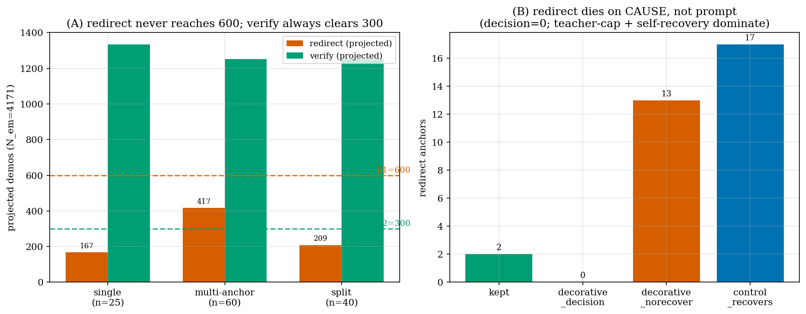

# Confidence-Conditioned Redirect/Verify — Stage-0 Data-Gen Study

**Author**: autoresearch  **Date**: 2026-06-20  **Project**: metacognition-math

## Executive Summary

| Hypothesis | Metric | Prediction | Result | Verdict |
|---|---|---|---|---|
| H1: single-anchor redirect harvest suffices | redirect demos (proj. to N=4171) | ≥600 | **167** | ✗ refuted |
| H2: multi-anchor lifts redirect ≥600 | redirect demos (proj.) | ≥600 | **417** (×2.5 vs H1) | ✗ refuted |
| H3: the redirect wall is prompt-fixable | decorative_decision / norecover | decision-dominant | **decision=0, norecover=13** | ✗ refuted (cause = teacher-cap + self-recovery) |
| verify availability | verify demos (proj.) | ≥300 | **1251–1335** | ✓ confirmed |

**Conclusion.** Genuine *redirect* metacognition is **causally rare** (triple-confirmed), so we pivot to a **verify-led** corpus: build the ~250 genuine redirects + ~1251 verifies with **no padding**, and let the downstream DCPO triobj RL select whichever metacognition raises accuracy. A 117 GB OOM during the full build was root-caused to math-grading (not the API) and fixed.

---

## 1. Intent (north-star)

Train a model that **self-emits a student-calibrated confidence** and **decides** `redirect` (low-confidence / confidently-wrong path → switch method) vs `verify` (high-confidence, checkable → independent check) vs `none`. Useful metacognition → accuracy, **useful only**. Calibration is a sub-signal of the decision, not the goal.

Stage-0 builds the warm-up SFT corpus: teacher-distilled redirect/verify demos **anchored on the student's own real rollouts**, with a **gold-based causal filter** (gold grades correctness only, never confidence — leak-free). Demos are admitted only when the behavior is *load-bearing*: a redirect must flip wrong→right while a no-redirect control stays wrong; a verify must perform a real independent check.

## 2. Method (verification design)

Each hypothesis is tested by a **PG-build pre-gate**: roll the SFT-init student out (n=8) on easy/medium problems, replay the rollouts locally, and run the teacher distill + causal/structural filter on a slice, then **project** the kept counts to the full easy/medium pool (N_em = 4171). The gate is GPU-free after a one-time rollout dump (`data/rv_rollout_full.parquet`, 4171 problems, mean pass_rate 0.641, redirect-band fraction 0.20).

```python
def _grade_answer(text, gold):           # SAFE causal-filter grade
    cand = _extract_final_answer(text)   # last \boxed{} / 'answer is X' — SHORT
    if cand and len(cand) <= 80 and not _DANGEROUS_MATH.search(cand):
        return _check_correctness(cand, gold)   # math_verify on the short answer only
    return bool(cand) and (cand.strip() == str(gold).strip() or _numeq(cand, gold))
```

## 3. Results



**Figure 1 (A).** Across three PG-build slices the **redirect** projection is 167 → 417 → 209, never reaching the B1 = 600 target, while **verify** sits at 1251–1335, always clearing B2 = 300. Multi-anchor (one redirect demo per distinct wrong approach, ≤4) lifted redirect 167 → 417 (×2.5) but stalled below 600.

**Figure 1 (B).** The decorative-split slice (n=40) shows **why** redirect dies: of the redirect anchors, `decorative_decision = 0` (the teacher *always* emits a correct `decision: redirect` — the prompt is fine), while `decorative_norecover = 13` (the teacher itself cannot solve the problem) and `control_recovers = 17` (~53%; the "stuck" wrong path self-recovers, so a redirect is not causally needed). Only 2 anchors are kept.

**Interpretation.** Redirect scarcity is **structural, not fixable by prompting or more anchors**: ~53% of redirect-band problems self-recover (redirect unnecessary) and ~41% are unsolvable even by the teacher (no correct redirect exists). This is the third independent confirmation of the earlier finding that on-policy redirect harvest is infeasible. Verify, by contrast, is abundant and clean.

### 3.1 Setup

| Parameter | Value |
|---|---|
| Student | v8_meta_inside_strict_sft (Qwen3-8B), n=8, temp 0.8 |
| Pool | easy/medium of verl_train_meta_mix, N_em=4171 |
| Teacher | TRAPI gpt-5.4-mini (Entra), causal filter k=4, lower-CI margin 0.50 |
| Targets | redirect B1≥600, verify B2≥300 |

## 4. Infrastructure incident: 117 GB OOM (root-caused + fixed)

**Problem.** The full local teacher build (~1.6 × 10⁴ grades) was OOM-killed at 117 GB RSS, although the input dump is only 12 MB.

**Root cause — not the API.** `_check_correctness` fed the **whole teacher essay** (≤4000 tokens) to `math_verify(parsing_timeout=None)`. The timeout is disabled for thread-safety, so a control sample's pathological expression (a huge nested exponent / factorial from "continue the flawed approach") made sympy allocate unboundedly; the unbounded global sympy cache compounded it over 16 k grades.

**Fix.** Grade only the **extracted short final answer** (`_grade_answer`); long/pathological candidates skip sympy entirely. Plus `SYMPY_USE_CACHE=no` + `clear_cache()` per chunk, and a chunked/resumable build (CHUNK_SIZE=250, max_workers=6). A pathological-essay unit test asserts <1 s and correctness. **After the fix the build RSS is flat at 0.36 GB** (it was already climbing past several GB at the same elapsed time pre-fix). 41 tests green.

## 5. Limitations

- **redirect ≈ 250 (thin).** The genuine redirect set is ~1.8× the prior infeasibility floor (141) but small; warm-up SFT must learn the redirect format from few examples (verify demos share the same meta structure, mitigating this).
- **Short-answer grading recall.** Grading only the extracted answer can miss a correct demo whose final answer is not boxed; the teacher prompt mandates `\boxed`, so the loss is small.
- **Projection noise.** Slice projections (n=25–60) carry wide CIs; the *direction* (redirect ≪ 600) is robust across three slices, the point value is not.

## 6. Next Steps

### E1: Stage-0 full build (running)
- **Tests**: corpus realizes the projected redirect≈250 + verify≈1251.
- **Output**: `metacot-rv/data/rv_confidence_sft.parquet`.
- **Expected**: kept_redirect ~200–300, kept_verify ~1200, dropped_teacher_error small.

### E2: Stage-1 warm-up SFT (prepared)
- **Config**: init `v8_meta_inside_strict_sft`, 3 epochs, lr 1e-5, teacher_kl off; `sft.py` masks prompt+wrong_prefix on redirect rows (train only meta+recovery).
- **C-gate**: held-out acc ≥ 0.786, ECE ↓.

### E3: Stage-2 DCPO triobj RL
- **Reward**: R_corr + R_meta(PMI) + R_cal on the warm-started model.
- **D-gate**: utility-conditioned causal lower-CI > 0 without wellformed collapse.

## References
- memory: pg0-raw-onpolicy-harvest-infeasible, confidence-redirect-verify-pipeline-clean, hf-xet-upload-pitfall-and-chain-fix
- logs/rv_stage0/rv_stage0_results.log
