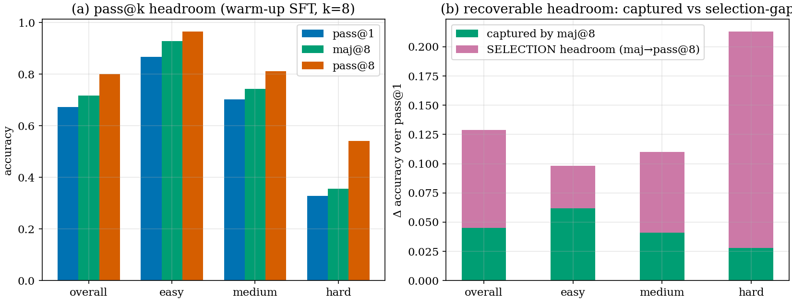
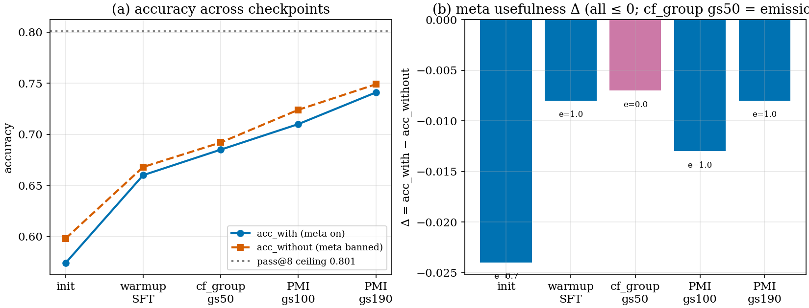
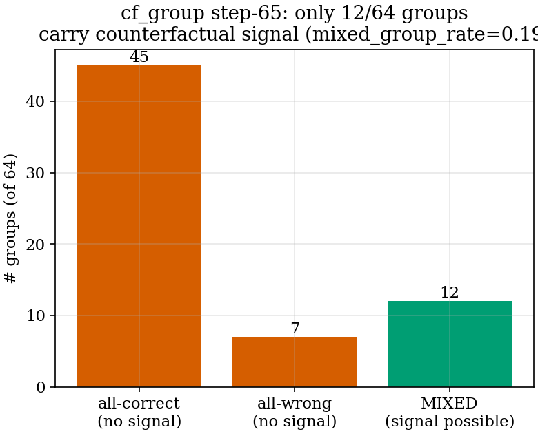

# Useful Metacognition for Math Reasoning — Why It Hasn't Worked Yet, and the Fix We Are Testing

**Author**: Seungpil Lee (+ Claude)  **Date**: 2026-06-22  **Project**: metacognition-math (confidence-rv)

---

## Executive Summary

We are training a language model to *decide when to think about its own thinking*
(verify / redirect / abstain) so that doing so **raises** its math accuracy. We taught
the model the format successfully, but reinforcement learning (RL) made the
metacognition **net-harmful**. This report explains, hypothesis by hypothesis, what we
tried, what came out, and what each result means — and the fix we are now implementing.

| Hypothesis | What we tested | Headline metric | Result | Verdict |
|---|---|---|---|---|
| **H1** | SFT-taught verify/redirect + RL (reward = "PMI") makes meta *causally useful* | Δ = acc_with − acc_without | gs100 **−0.013** → gs190 **−0.008** | **Falsified** (meta net-harmful, flat with training) |
| **H2** | The PMI reward rewards *coherence*, not *causal usefulness* → generic-verify collapse | meta content + emission rate | **94% generic "verify", emission 1.000, breaks 16 > saves 11** | **Confirmed** (mechanism) |
| **H3** | Rewarding the *counterfactual answer-change* fixes it (abstain + don't break correct answers) | — | implementation in progress | **Pending** |

**One-sentence conclusion:** the model's metacognition fails not because it is badly
trained or badly formatted, but because the **reward measures the wrong thing** — it
pays the model for writing a plausible-looking "let me double-check," regardless of
whether the check ever catches anything; we are replacing it with a reward that pays
only when the metacognition *actually changes a wrong answer into a right one*.

---

## 1. Background and Intent (for a first-time reader)

**The goal.** Humans solving a hard problem do *metacognition*: "I'm not sure about this
step — let me verify it," or "this approach is going nowhere — let me switch methods."
We want a model to do the same — but **only when it helps**. Concretely, inside its
answer the model emits a special block:

```
<|meta|> ... reasoning about its own confidence ... decision: verify | redirect | none <|/meta|>
```

- **verify** — the model is fairly confident and the claim is checkable, so it does an
  independent check.
- **redirect** — the model thinks it is likely wrong / stuck, so it switches method.
- **none** — no metacognition needed (abstain).

**The north-star.** *Useful metacognition → higher accuracy, and only when useful.*
Metacognition is a **means**, not an end. Getting the model to *talk about* its
confidence is easy; getting that talk to **causally raise accuracy** is the hard part,
and is the entire point.

**How we measure "useful" (the key metric).** For every test problem we decode the
answer **twice** under identical weights:

- **arm A (with meta):** normal decoding — the model may emit `<|meta|>`.
- **arm B (without meta):** the `<|meta|>` open token is forbidden (its logit driven to
  −∞), so the model must solve *without* metacognition.

Then **Δ = accuracy(with) − accuracy(without)** is the **causal contribution of
metacognition**. Δ > 0 means meta helps; Δ < 0 means meta *hurts*. This is the number
every hypothesis below is judged on.

---

## 2. Method (the pipeline)

| Stage | What it does |
|---|---|
| **Stage-0** | A teacher model (GPT-class via TRAPI) distills a corpus of verify/redirect examples anchored on the *student's own* wrong attempts; the gold answer is used only to check correctness, never to set confidence (no-leak). 562 redirect + 1219 verify rows. |
| **Stage-1** | Warm-up supervised fine-tuning (SFT) on that corpus, so the model learns the meta *format*. |
| **Stage-2** | RL (a GRPO-variant we call DCPO) that is supposed to make the meta *causally useful*, using several reward "heads" combined into the policy-gradient advantage. |

The Stage-2 reward combines five heads onto the advantage: **correctness** (is the final
answer right), **R_meta** (the meta-quality signal — this is the one that matters here),
**calibration**, **emission** (don't go silent), and **format** (well-formed meta). The
current R_meta is **PMI** (defined in §4).

---

## 3. Results, Hypothesis by Hypothesis (with interpretation)

### 3.1 H1 — "SFT + RL with the PMI reward makes meta causally useful (Δ > 0)"

**Intermediate result (Stage-1, format only).** The warm-up SFT *passed* its gate:
accuracy-with-meta rose **+8.6 pp** over the initialization on the same validation set,
and the model emitted well-formed meta on essentially every problem.
*Interpretation:* the model **learned the format** and did not lose accuracy — but this
says nothing about *causal usefulness*; it only says "the meta is there and looks right."

**Main result (Stage-2, the real test).** After RL, the counterfactual Δ was **negative
and stayed negative** as training continued:

| Checkpoint | acc_with | acc_without | **Δ** | saved | broke | emission |
|---|---|---|---|---|---|---|
| gs100 | 0.710 | 0.724 | **−0.013** | 12 | 20 | 1.000 |
| gs190 (+90 steps) | 0.741 | 0.749 | **−0.008** | 11 | 16 | 1.000 |

*(source: HF `iamseungpil/metacot-rv` eval/rv_dcpo_gs100, eval/rv_dcpo_gs190; n=594.)*

**Interpretation — H1 is falsified, two ways:**
1. **Meta is net-harmful.** Δ < 0 means turning metacognition *off* would *raise*
   accuracy. The "saved vs broke" columns show why: the meta rescues a handful of wrong
   answers (11–12) but **breaks more correct ones** (16–20). Net negative.
2. **It is not a "needs more training" problem.** Over 90 extra steps Δ moved only
   −0.013 → −0.008 (within noise), while absolute accuracy rose (0.710 → 0.741 acc_with)
   — i.e., the model got *better at solving* but the *meta contribution* stayed harmful.
   Because the mechanism (below) does not change with more steps, extrapolating Δ to
   positive is unjustified. **The bottleneck is structural, not the amount of training.**

**Where exactly does meta hurt? (stratified, gs190)**

| Stratum | n | Δ |
|---|---|---|
| easy | 198 | −0.005 |
| medium | 261 | −0.004 |
| hard | 135 | **−0.022** |
| redirect (scenario) | 309 | −0.013 |
| verify (scenario) | 285 | −0.004 |

*Interpretation:* there is **no regime where meta is clearly positive** — it ranges from
roughly neutral (easy/medium, where it occasionally breaks a correct answer) to clearly
harmful (hard, where redirect flails). A useful metacognition system would show at least
one stratum with Δ ≫ 0; this one does not.

**A subtle but important reading (Stage-1 vs Stage-2 dissociation):** SFT fixed the
*format* (C-gate +8.6 pp) but RL could not make it *causally useful*. That dissociation
points the finger at the **RL reward**, not at the SFT data or the format — which sets up
H2.

### 3.2 H2 — "The PMI reward rewards coherence, not causal usefulness"

**Result (reading what the model actually writes).** We read the emitted meta text and
counted decisions:

- **~94% of metas are `decision: verify`** (14 verify : 1 redirect in the sampled stream).
- **emission rate = 1.000** — the model *always* emits meta; it never abstains.
- The verify is a near-identical **template**: *"X looks plausible but should be
  independently checked before accepting it → decision: verify,"* followed by a **full
  re-derivation** of the answer (not a targeted check of one risky step).

**Interpretation — confirmed, with the mechanism.** On an *easy* problem the answer is
already correct, so a fluent "let me verify by re-deriving" is (a) **coherent** and (b)
**lands on a correct answer** — and the PMI reward (§4) pays for exactly that
combination. There is **no term anywhere that asks "would the answer have been correct
*without* this meta?"** So unnecessary meta is never penalized, only coherent meta is
rewarded → the reward's optimum *is* "emit a coherent generic verify everywhere," and
re-deriving an already-correct answer is a pure downside dice-roll that sometimes
recomputes wrongly and **overrides a correct answer** (the "broke 16 > saved 11"). This
mechanistically explains H1's flat-negative Δ. *(Caveat: this is a triangulation of
content + reward definition + the Δ pattern, not a controlled ablation — which is exactly
what H3 provides.)*

### 3.3 H3 — "Reward the counterfactual answer-change, not coherence" (being tested)

**The idea.** Replace the coherence reward with the thing we actually care about: did the
meta **change a wrong answer into a right one**? That is the counterfactual
`correct_with − correct_without` — literally the north-star metric used as the *reward*.
If the meta does not change the answer (easy, already correct), the reward is zero → the
model is **not paid to emit unnecessary meta** → it learns to **abstain**. If the meta
breaks a correct answer, the reward is negative → it learns **not to break**.

**Doing it cheaply (the trick from prior work).** Naively this needs a second decode per
training rollout (~2× cost), which is why PMI was used instead. The fix (GRPO-as-PRM,
2509.21154) is to **branch the existing rollout group**: we already sample 8 rollouts per
problem; we make 4 of them emit meta and force 4 to solve *without* meta (the same
meta-open ban used at eval). The group-relative advantage then *equals* the counterfactual
answer-delta **for free** — no extra decode. (See §5.)

**Status:** implementation in progress (§6). **Prediction (how we will judge it):** Δ
rises above gs190's −0.008 toward positive, emission rate drops below 1.0 (abstention
appears), and saved ≥ broke.

---

## 4. The Reward Problem, Explained Simply

Think of grading a student's "double-check" work:

- **PMI (current) ≈ "grade the double-check on how neat and natural it looks, as long as
  the final answer is right."** A student who writes a tidy "let me re-verify…" on *every*
  problem — even ones they already nailed — scores well. Worse, re-doing an
  already-correct problem occasionally introduces a fresh mistake. Technically PMI is the
  *likelihood-delta*: how much the meta text raises the probability of its own
  continuation versus a placebo ("Let me continue."), correctness-gated. It measures
  **fluency-correlated-with-correctness**, not whether the check *did anything*.

- **Counterfactual (proposed) ≈ "grade the double-check by comparing the student's score
  *with* it versus *without* it."** A double-check that changes nothing earns nothing
  (so stop doing it on easy problems). A double-check that catches a real error earns a
  lot. A "double-check" that corrupts a right answer is penalized. This is exactly the
  behavior we want.

---

## 5. The Fix Being Implemented (design)

**Backbone — group-branch counterfactual `R_meta`:** split each 8-rollout group into 4
with-meta + 4 without-meta (meta-open token banned). Grade both arms against gold. The
group-relative correctness advantage now embeds `correct_with − correct_without` at no
extra decode cost. (Decisions locked: **4/4 split**, route onto the **answer region**,
**fully replace** PMI.)

**Shaping layered on (all from 2024–25 prior work, computed from the same branched
siblings, no extra decode):**
- **SCoRe transition bonus** (2409.12917): `α·(correct_with − correct_without)` with
  **α > 1** so *right → wrong* (breaking a correct answer) is the most-penalized event —
  the direct cure for "breaks > saves."
- **AdaCoT over-trigger penalty + decision-token masking** (2505.11896): penalize emitting
  meta on a problem the without-meta arm already solved, and protect the verify/redirect/
  none decision from collapsing into "always trigger."
- **AdaptThink accuracy-floor** (2505.13417): forbid pushing meta-emission up on a group
  where with-meta accuracy is below without-meta — net-harmful meta is structurally
  blocked.

**Safety:** every new knob defaults OFF, so existing configs are byte-identical (no
regression — test T1); a synthetic-group test (T2) proves the new heads *actually reach*
the advantage computation (guarding against this project's recurring "computed-but-unused"
inert-reward trap).

---

## 6. Current Status

- **Implementation:** an orchestrated multi-agent run (plan → TDD implement → adversarial
  verify → fix) is editing the core RL reward/advantage code (≈363 lines across
  `dcpo_region.py`, `verl_sdc.py`, `verl_sdc_utils.py`, the config) plus a new test file.
  Awaiting the adversarial-verify result before we commit.
- **Infrastructure notes (for reproducibility):** the original RL run hung mid-training at
  step 194 on a verl+vLLM deadlock (a healthy node, no code fault); two resume attempts
  lost the Standard-tier idle-suspend lottery, so we pivoted to evaluating Δ at the saved
  gs190 checkpoint (90 steps past gs100) — which is what gave the decisive H1 result.

---

## 7. Limitations and Next Experiments

**Limitations.**
- **Reward sparsity (the main risk of H3).** The counterfactual signal is informative only
  on *mixed-correctness* groups (where with/without arms disagree); easy (all-correct) and
  hard (all-wrong) groups give ~zero meta signal, and a 4-sample arm is high-variance.
  *Mitigation:* pair with **mixed-band training data** (filter to problems whose pass-rate
  is 0.125–0.875), so most groups are informative; fallbacks are a small dense PMI
  shaping term or a dense-causal PRIME value head (2502.01456).
- H2 is a triangulated diagnosis, not a controlled ablation; H3's A/B *is* the ablation.
- Δ is measured on a 594-problem held-out set; small strata (e.g. hard/verify, n=22) are
  noisy.

**Next experiments.**
- **E1 (this fix):** run RL with group-branch counterfactual + SCoRe/AdaCoT shaping;
  judge by Δ > 0, emission < 1.0, saved ≥ broke, wellformed ≥ 0.40. Monitor live with the
  autoresearch loop.
- **E2 (sparsity):** the same reward on mixed-band data; compare Δ and meta-learning
  stability against E1.
- **E3 (validation):** final 1030-problem @ 16k headline eval versus base-GRPO (0.770) and
  meta-GRPO (0.817); cross-model causal check (Spurious-Rewards safeguard, 2506.10947) to
  confirm Δ > 0 is real and not a GRPO prior-amplification artifact.

---

## 8. [NEW] Update 2026-06-22 — Headroom, cf_group Forensics, and the GPU-Free Data Pivot

This update adds four results obtained after the H3 implementation landed. Together they
answer the question the report left open ("does metacognition have room, or is this a
task-fit ceiling?"), diagnose why the live cf_group run *looked* broken, and record a
strategic pivot that unblocks data generation from the cluster-capacity bottleneck.

### 8.1 EXP-A — Headroom is real: a perfect selector could add +12.9% accuracy

**Definition.** *Headroom* is `pass@k − pass@1`: the accuracy a perfect verifier/selector
could recover by choosing among the model's own k samples. *Selection-headroom* is
`pass@k − maj@k`: the part that naive majority voting (self-consistency) leaves on the table.
Both are measured on the warm-up SFT (k=8, T=0.8, 594 held-out problems)
(source: logs/confidence_rv_0622/confidence_rv_0622_results.log EXP-A).



| Stratum | pass@1 | maj@8 | pass@8 | **headroom** | **selection-headroom** |
|---|---|---|---|---|---|
| OVERALL | 0.672 | 0.717 | 0.801 | **+0.129** | **+0.084** |
| easy | 0.867 | 0.929 | 0.965 | +0.097 | +0.036 |
| medium | 0.702 | 0.743 | 0.812 | +0.110 | +0.069 |
| **hard** | 0.328 | 0.356 | 0.541 | **+0.213** | **+0.185** |

**Figure 8.1 interpretation.** The overall +12.9% headroom **refutes the "task-fit ceiling"
hypothesis**: the model already *produces* a correct answer among 8 samples far more often
than it expresses one. The decisive detail is panel (b): majority voting captures only
+4.5% of the +12.9%, leaving a **+8.4% selection-headroom** overall and **+18.5% on hard**.
On hard problems the correct answer is a *minority* among the 8 samples (maj@8 captures
+2.8% of a +21.3% ceiling), so a model that could *verify/select* its own correct sample —
not just vote — would capture what self-consistency cannot. This is the precise opening
that useful metacognition targets.

### 8.2 EXP-B — Neither PMI nor cf_group achieves useful meta; PMI has higher raw accuracy

Plotting every checkpoint's counterfactual eval on the same 594-problem held-out set
(source: logs/confidence_rv_0622/confidence_rv_0622_results.log EXP-B) corrects an earlier
framing: PMI's absolute accuracy is in fact *higher* than cf_group's.



| Checkpoint | acc_with | acc_without | Δ | emission | reading |
|---|---|---|---|---|---|
| warm-up SFT (RL init) | 0.660 | 0.668 | −0.008 | 1.00 | baseline |
| cf_group gs50 | 0.685 | 0.692 | −0.007 | **0.00** | faithful reward → abstention |
| PMI gs100 | 0.710 | 0.724 | −0.013 | 1.00 | always-meta, net-harm |
| PMI gs190 | 0.741 | 0.749 | −0.008 | 1.00 | always-meta, net-harm |

**Figure 8.2 interpretation.** Both arms raise accuracy off the 0.660 baseline, but the gain
is the *correctness* reward improving the answer region — **not** useful meta: every Δ stays
≤ 0 (PMI's meta is net-harmful dead weight; cf_group's faithful reward drives emission to 0,
so meta is simply absent). PMI gs190 (0.741) exceeds cf_group gs50 (0.685), but the
comparison is confounded by training length (190 vs 50 steps; cf_group runs kept dying) —
interpolating PMI to gs50 gives ~0.69, essentially tied. The honest summary: **plain RL on
correctness already captures ~60% of the headroom with vestigial meta; the remaining gap to
the 0.801 ceiling is where useful meta must earn its place.** cf_group's value here is
*diagnostic* (it proves the v8 meta is causally useless by killing it), not accuracy.

### 8.3 EXP-C — The live cf_group run was healthy; `acc_without=NaN` was a logging artifact

The live run alarmed on `dcpo/acc_without = NaN`, suggesting the counterfactual was broken.
Forensics on the step-65 rollout table (512 rows = 64 groups × 8) showed otherwise
(source: logs/confidence_rv_0622/confidence_rv_0622_results.log EXP-C).



**Figure 8.3 interpretation.** The NaN is a **logging artifact**: the trend scalar reads
`heads["c_without"]` (the PMI-era second-decode field) which cf_group never fills — its
without-arm rows are real GRPO group members whose correctness lives in `c_with`, with the
delta routed to `dcpo_ans_meta`. The run itself is healthy (placebo arm injected,
arm-stash WARN = 0, response_length/min = 84). The *real* finding is structural:
**only 12 of 64 groups are mixed-correctness** (`mixed_group_rate = 0.19`); the other 52 are
all-correct or all-wrong, so their counterfactual delta is exactly zero. This is the same
~15–19% slice EXP-A flagged, and it bounds how much signal the cf_group reward can ever
produce. We added `cfgroup_scalar_summary` (commit 4dbf583) charting
`dcpo/cfgroup/{delta, acc_with_arm, acc_without_arm, mixed_group_rate}` so the true signal
is observable on the next run.

### 8.4 EXP-D — The data fix runs GPU-free; the capacity bottleneck is irrelevant to it

The three results above converge on one diagnosis: the v8 SFT meta is *hollow form, not
behavior* (a directly-read v8 "redirect" dismisses a strawman around an already-correct
solution), so the fix is a **functional-redirect SFT** anchored on the student's real errors.
The pivot is that this data does **not** need the contended H100 cluster (source:
logs/confidence_rv_0622/confidence_rv_0622_results.log EXP-D).

- The student rollouts already exist — `rv_rollout_full.parquet`, **4171 problems** with
  per-sample text + grade + gold (2659 mixed; 834 in the [0.125, 0.5] band; difficulty
  medium 1554 / easy 1105 / **hard 0**, since hard is mostly all-wrong with no recoverable
  signal).
- The teacher is **TRAPI (GPT-class) over an API** — it runs on a login node, no GPU. A live
  probe confirmed it: given the wrong prefix "2 + 2 = 5 because", the teacher emits a
  *functional* redirect — `confidence: 0.20` (the student's value, not inflated),
  `decision: redirect`, judgment-only inside the meta block, then a genuine method switch
  (counting) to `\boxed{4}`. This is exactly what the hollow v8 redirect was not.

We wired a `--rollout_parquet` path (reads the pre-computed rollouts instead of a vLLM node)
and launched generation on the login node. First progress: **20/600 problems → 5 kept demos
(~25% yield)** through the full causal/calibration filter, no errors — projecting ~150 demos
at pool 600 and ~1000+ over the full 4171, against the ~1500 target. The on-policy harvest
(which PG0 already showed yields only ~141) is dropped in favor of this.

**Updated verdict on H3.** The counterfactual reward is *correct* but starved: with a hollow
SFT it has no genuine redirect to amplify (Gandhi 2503.01307 — RL amplifies latent behaviors,
it does not create them). The decisive lever is therefore the **functional-redirect SFT**
(EXP-D), with cf_group RL as the *second* stage on top of it.

---

## References

- Math-Shepherd (2312.08935); Let's Verify Step by Step / PRM800K (2305.20050);
  Implicit PRM / Free Process Rewards (2412.01981); PRIME (2502.01456);
  GRPO-as-PRM / λ-GRPO (2509.21154 / 2510.00194); RLOO (2402.14740);
  SCoRe (2409.12917); AdaCoT (2505.11896); AdaptThink (2505.13417);
  Spurious Rewards in RLVR (2506.10947); RLCR (2507.16806).
