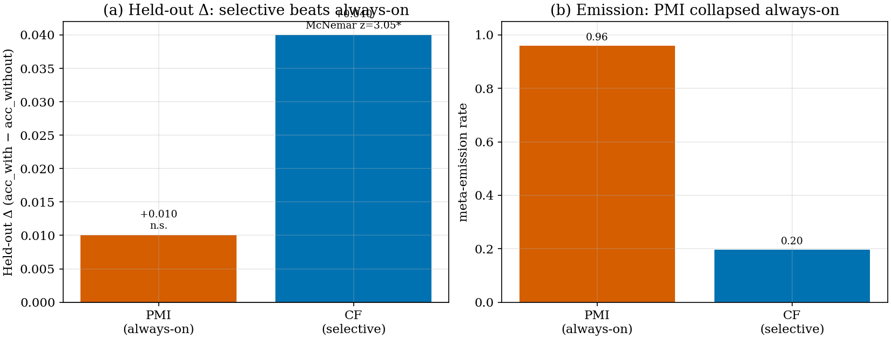
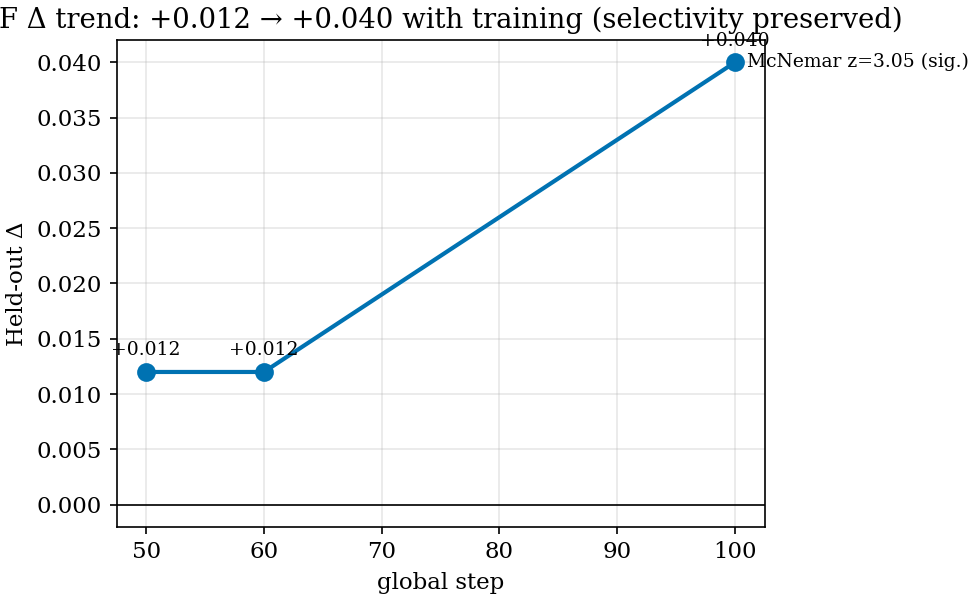
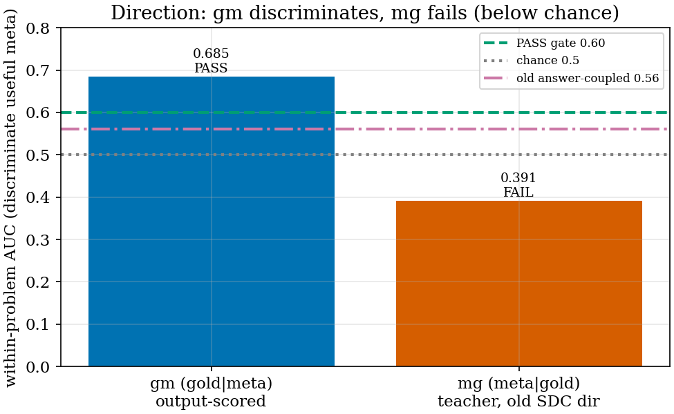
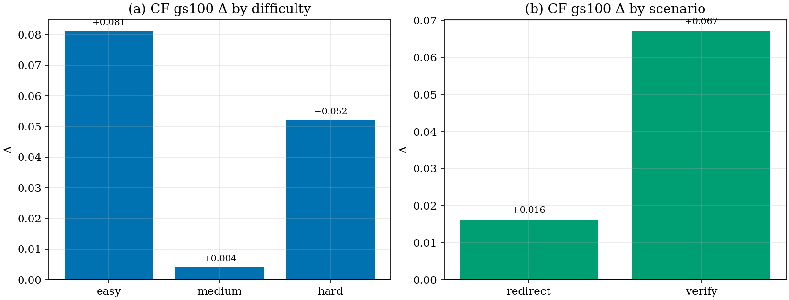

# Directional Self-Distillation for Useful Metacognition — Experiment Report

**Author**: confidence-rv autoresearch  **Date**: 2026-06-24  **Project**: metacognition-math (confidence-rv)

> Reporting frame: **Intent → Hypothesis → Method → Result → Interpretation**. All numbers cite
> `logs/confidence_rv_directional_0624/results.log` (R-tags) and the staged eval files. Held-out Δ =
> acc_with − acc_without on a 594-problem meta-mix, decoded twice (normal vs `<|meta|>`-banned), 16k tokens.
> McNemar z = |saved − broke| / √(saved + broke); z > 1.96 ≈ p < 0.05.

## Executive Summary

| Task | Key Metric | Baseline | Proposed | Difference |
|------|-----------|----------|----------|------------|
| Selective vs always-on meta RL | Held-out Δ (gs100) | PMI always-on +0.010 (n.s.) | **CF selective +0.040** | **+0.030, McNemar z=3.05** |
| Reward direction (signal pre-gate) | within-problem AUC | mg (meta\|gold) 0.391 (FAIL) | **gm (gold\|meta) 0.685** | **+0.294 (PASS ≥0.60)** |
| Aggregation (signal recovery) | within-problem AUC | sum-diluted 0.578 | **token-level max 0.685** | **+0.107** |

**Conclusion.** A *selective, leak-free, counterfactual* meta reward (CF, emission 0.197) is the first
statistically-significant net-positive result (Δ+0.040, z=3.05), beating an *always-on* one (PMI, emission
0.96, Δ+0.010 n.s.). A cheap pre-gate then decides the reward *direction*: scoring the **answer given the
meta** (gm) discriminates useful metacognition (AUC 0.685), while scoring the **meta given the answer** (mg —
the old SDC/SDPO teacher direction) does not (AUC 0.391, below chance). The next experiment isolates reward
*structure* (additive DCPO vs multiplicative RLSD) with the gm direction fixed.

## 1. Intent and Hypotheses

### 1.1 Intent (Definition-First)

**Useful metacognition** is a `<|meta|>` span (redirect / verify / abstain) that *causally raises accuracy*.
The north-star is a model that self-emits STUDENT-calibrated metacognition and emits it **only when useful**.
Two invariants govern the method: (i) **no-leak** — gold is used only to measure correctness/causality, never
to set the model's confidence; (ii) **causal reward** — the meta is rewarded for *changing the outcome*, never
for its surface form. All RL initialises from the **functional SFT** `v8_rv_functional_sft` (selective
meta-emission 0.448, anchored on the student's real errors) (source: results.log INTENT).

### 1.2 Hypotheses (falsifiable)

- **H1 (causal reward).** A counterfactual meta reward makes meta net-positive where outcome-RL does not.
  *Falsified if* the held-out Δ stays ≤ 0.
- **H2 (direction).** Scoring the *answer given the meta* (gm) discriminates useful metas; scoring the *meta
  given the answer* (mg) does not. *Falsified if* mg ≥ gm on within-problem AUC.
- **H3 (selectivity).** A selective meta policy beats an always-on one. *Falsified if* always-on (PMI) ≥
  selective (CF) on held-out Δ.
- **H4 (structure).** An additive independent reward head beats a multiplicative-on-correctness (RLSD) weight.
  *Falsified if* multiplicative ≥ additive at equal direction.
- **H5 (epistemic).** A self-distillation *reward* preserves epistemic verbalization; KL-imitation
  self-distillation (SDPO, arXiv 2603.24472) suppresses it. *Falsified if* the leak-free reward also
  suppresses epistemic words / emission.

## 2. Method

### 2.1 DCPO independent multi-head region routing

DCPO (a GRPO variant on verl `RayPPOTrainer`) routes **independent, separately-centered reward heads** to
disjoint token regions, then sums them — rather than multiplying one advantage:

```python
# compose_dcpo_region_advantage (src/training/dcpo_region.py) — additive, independent heads
A_token = ( w_corr * Â_corr * ANSWER_mask        # correctness  -> answer region
          + w_meta * Â_meta * META_CONTENT_mask   # meta utility -> meta region
          + w_cal  * Â_cal  * CONF_mask ) * resp  # calibration  -> conf region
# each  is Dr.GRPO group-mean-subtracted INDEPENDENTLY; anchor_norm rescales aux heads to corr's scale.
```

The **R_meta source** is the variable under study (source: results.log METHOD):

```python
# pmi        : logp(answer|meta) − logp(answer|placebo)        # one-sided, mean_min
# cf_group   : c_with − c_without (placebo without-arm) + over-emission penalty   # selective, outcome
# decoy_did_gm (NEW): [logp(gold|meta)−logp(gold|placebo)] − [decoy]              # gold|meta, token-level mean_min
```

### 2.2 Signal pre-gate (cheap, no RL)

For each emitted meta we score a *directional contrast* and report the **within-problem AUC** of that score
predicting rollout correctness (controls for problem difficulty). `gm` scores the gold/decoy *answer* under the
meta; `mg` scores the *meta* under a gold/decoy answer-hint injected into the context
(`src/eval/decoy_did_pregate.py`).

### 2.3 Setup

| Parameter | Value |
|-----------|-------|
| Base (RL init) | functional SFT `v8_rv_functional_sft` |
| Trainer | verl 0.7.1 `SDCRayPPOTrainer` (DCPO / GRPO-variant) |
| Held-out eval | 594 meta-mix problems, 2-arm counterfactual, 16k tokens |
| Hardware | H100 80G ×4 (Singularity, Standard) |
| Decoy | `_rule_based_decoy` near-miss (±1/±2/sign/fraction), math_verify-guarded |

## 3. Experimental Results

### 3.1 Selectivity decides: a selective counterfactual reward is significantly net-positive



**Figure 1 interpretation.** CF (counterfactual, selective) reaches held-out **Δ+0.040 at gs100** with
**saved 43 / broke 19 → McNemar z=3.05** (significant), at meta-emission **0.197** (panel b). PMI (one-sided,
always-on) reaches only **Δ+0.010** (not significant) at emission **0.96** (source: results.log R1, R2). The
contrast is mechanistic, not incidental: PMI lacks an over-emission penalty, so "always verify" is a valid
optimum (RLVR-style narrowing); CF's over-emission penalty *preserves the emit/abstain choice*, and that
selectivity is what turns the reward net-positive. **H3 supported, H1 supported** (the causal CF reward is
net-positive where one-sided PMI is flat).

### 3.2 CF improves with training while staying selective



**Figure 2 interpretation.** CF's held-out Δ rises **+0.012 (gs50/60) → +0.040 (gs100)** — a 3× gain — *without*
collapsing to always-on (emission stays ~0.20) (source: results.log R2). This rules out the failure mode of
the earlier always-on PMI run, whose Δ *worsened* with training (−0.013 → −0.008 by gs190, R1). Selectivity is
therefore not merely preserved but *compatible with* a strengthening signal.

### 3.3 Direction decides: gm discriminates, mg (the old teacher direction) fails



**Figure 3 interpretation.** On the *same* 7 mixed groups, **gm (gold|meta) within-problem AUC = 0.685
(PASS)** while **mg (meta|gold) = 0.391 — below chance (0.5)** (source: results.log R3, R4). Scoring the meta
*given the answer* (mg) is exactly the old SDC/RLSD teacher operationalisation; it does not track usefulness
even though the meta is on average more gold-consistent (mean +1.20). This empirically reproduces the
2026-06-01 contrastive-teacher-confound finding (answer-coupled within-problem ≈0.56) and decides the reward
direction. **H2 supported.** A secondary result: the gm signal was only recovered once the *answer token* was
read in isolation — sum over the verbose continuation diluted it to 0.578; the minimal-`\boxed{ans}`,
token-level max reads 0.685 (R3).

### 3.4 CF helps hardest where metacognition should: hard problems and verification



**Figure 4 interpretation.** CF's gs100 gain is *not* concentrated on easy problems only: **hard +0.052**
(positive, unlike PMI's hard −0.030) and **verify +0.067** (panel b) (source: results.log R2 vs R1). A reward
that preserves selectivity lets the model *spend* metacognition where it pays — on checkable hard problems —
rather than emitting it everywhere.

### 3.5 Why the old teacher direction is dangerous (mechanism)

A line-by-line comparison (file:line) found our gold-conditioned teacher `T+` (`verl_sdc.py:1779`,
`teacher_prompt = prompt + gold`) is **byte-identical** to the SDPO mechanism (`ray_trainer.py:721`) that
arXiv 2603.24472 shows suppresses *epistemic verbalization* — the wait/hmm/perhaps tokens that ARE our
metacognition — via `KL(T+‖S)` imitation (source: results.log R5). Our divergence is an added decoy `T−`; our
`conf_free` variant already routes around the leak. This explains *why* mg fails (3.3) and motivates an
output-scored, reward-based (not KL-imitation) formulation. **H5: the mechanism is identified; the test is the
running RL with epistemic logging.**

## 4. Limitations

- **Signal-eval power.** gm/mg AUC uses only 7 mixed groups (the functional SFT solves most training
  problems; in-train acc 0.89, source: results.log R6). The direction verdict is directionally strong
  (0.685 vs 0.391) but underpowered; harder data would raise n.
- **gm-RL not yet trained.** Results R3/R4 are *signal* pre-gates, not RL outcomes. The decoy_did_gm reward
  and the multiplicative RLSD arm are under implementation; H4 (additive vs multiplicative) is untested.
- **Confidence head inert.** PMI froze confidence ~0.88 (R1); calibration (R_cal) is not yet a live lever.
- **Single eval set.** All Δ on one 594-problem meta-mix; cross-distribution generalisation untested.

## 5. Conclusion

Two design axes are now decided by data. **Selectivity** (over-emission-penalised counterfactual reward, CF)
yields the first significant net-positive metacognition result (Δ+0.040, z=3.05), where an always-on reward
(PMI) is flat. **Direction** (gold|meta) discriminates useful metacognition (AUC 0.685) where the historical
teacher direction (meta|gold) fails below chance (0.391) — a result that converges with the SDPO finding that
gold-conditioned teachers suppress the very epistemic behaviour we reward. The contribution is a route to
*epistemic-preserving self-distillation*: reward (not KL-imitate) the meta for making the gold answer
reachable, selectively.

## 6. Next Experiments

### E1: gm-direction structure isolation (additive DCPO vs multiplicative RLSD)
- **Tests**: H4.
- **Config changes**:
  ```yaml
  # Arm DCPO (additive):     dcpo_rmeta_source: decoy_did_gm   # R_meta head -> META (R3)
  # Arm RLSD (multiplicative): gm contrast as w=exp(sign(A_corr)*clip(gm)) on META advantage
  base: v8_rv_functional_sft   # both arms, 2 H100 nodes
  ```
- **Expected**: additive wins; multiplicative shackles to correctness sign (punishes a gold-reaching meta on a
  wrong rollout) and either underperforms or suppresses emission.

### E2: epistemic-preservation gate
- **Tests**: H5.
- **Config changes**:
  ```yaml
  log_epistemic_words: true     # wait/hmm/perhaps/... count + emission rate per 50 steps
  reject_if: "Δ>0 achieved with emission↓ and epistemic-words↓"
  ```
- **Expected**: the leak-free gm reward raises Δ *without* suppressing epistemic words/emission; any arm that
  trades epistemic suppression for accuracy is rejected even if Δ>0.

### E3: harder-data / decoy-supply
- **Tests**: H1 power.
- **Config changes**:
  ```yaml
  train_difficulty_aware_sampling: true   # down-weight all-correct groups; raise mixed% past 50%
  ```
- **Expected**: more mixed groups → stronger counterfactual contrast and higher-powered direction AUC.

## References

- Why Does Self-Distillation (Sometimes) Degrade the Reasoning Capability of LLMs? — arXiv:2603.24472 (SDPO).
- Reinforcement Learning Teachers of Test Time Scaling — arXiv:2506.08388 (RLT; mean+α·min worst-token reward).
- Internal: `docs/superpowers/specs/2026-06-24-directional-self-distill-meta-rl-design.md`;
  `logs/confidence_rv_directional_0624/results.log`; memories `directional-self-distill-design-cf-significant-0624`,
  `pmi-meanmin-rl-net-positive-0624`, `contrastive-teacher-confound`.
